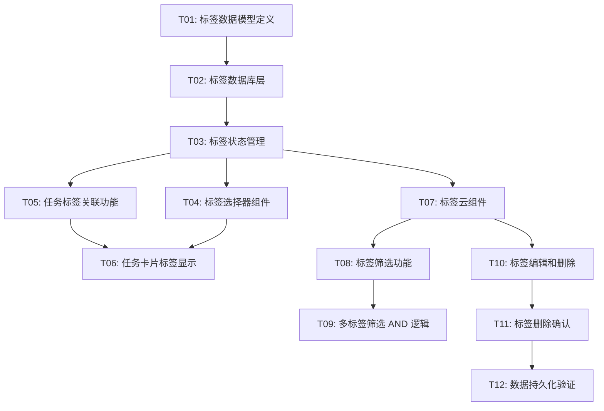

# F-002: 任务标签系统 — 开发任务计划

## 1. 任务概览

**总任务数**：12 个
**开发方法**：TDD — 每个任务按 RED → GREEN → REFACTOR 循环执行

**关键标注**：
- 🔒 阻塞任务：被多个任务依赖，建议优先完成
- ⚠️ 风险任务：技术难度高，可能需要额外时间

### 依赖关系图

### 可并行任务组

| 并行组 | 任务 | 说明 |
|--------|------|------|
| 1 | T04, T05 | 都依赖 T03，互不依赖 |
| 2 | T06, T07 | 都依赖 T04/T05/T03，可并行开发 |

---

## 2. 开发任务

### 阶段一：数据基础

**阶段完成标准**：标签数据可以创建、查询、删除，类型系统完整

---

#### Task-01: 标签数据模型定义 🔒

**通俗解释**：定义标签的 TypeScript 类型，让后续代码有类型支持

**做什么**：
- 在 `types.ts` 中新增 `Tag` 和 `TaskTag` 接口
- 定义标签颜色枚举或常量
- 更新相关类型导出

**涉及文件**：`src/renderer/db/types.ts`

**参考**：技术方案 章节 3 → AC-TAG-001, AC-TAG-012

**依赖**：无

**预估工时**：15 分钟

**验证标准**：
- [x] `Tag` 类型包含 id, name, color, usageCount, createdAt
- [x] `TaskTag` 类型包含 id, taskId, tagId, createdAt
- [x] 标签颜色常量定义 8 种预设颜色
- [x] 类型导出可用

---

#### Task-02: 标签数据库层 🔒

**通俗解释**：实现标签的增删改查，数据存储在 IndexedDB/localStorage

**做什么**：
- 实现 `src/renderer/db/tags.ts`
- 实现标签 CRUD 方法（createTag, getAllTags, updateTag, deleteTag）
- 实现任务 - 标签关联方法（addTagToTask, removeTagFromTask, getTagsByTaskId, getTasksByTagId）
- 标签名称唯一性校验（不区分大小写）

**涉及文件**：`src/renderer/db/tags.ts`, `src/renderer/db/index.ts`

**参考**：技术方案 章节 3 → AC-TAG-001, AC-TAG-003, AC-TAG-010, AC-TAG-011, AC-TAG-012

**依赖**：Task-01

**预估工时**：60 分钟

**验证标准**：
- [x] `createTag('工作', '#FF5722')` → 返回标签对象，包含 id, name, color
- [x] 创建同名标签（不同大小写）→ 抛出错误
- [x] `getAllTags()` → 返回所有标签
- [x] `updateTag(id, { name: '新名称' })` → 标签名称更新
- [x] `deleteTag(id)` → 标签删除
- [x] `addTagToTask(taskId, tagId)` → 建立关联
- [x] `getTagsByTaskId(taskId)` → 返回该任务的所有标签
- [x] `getTasksByTagId(tagId)` → 返回包含该标签的所有任务
- [x] 应用重启后标签数据依然存在

---

#### Task-03: 标签状态管理 🔒

**通俗解释**：标签数据可以在 React 组件间共享和更新

**做什么**：
- 创建 `src/renderer/store/tagStore.ts`
- 实现标签 CRUD 方法
- 实现任务 - 标签关联方法
- 实现标签筛选状态管理
- 连接数据库层

**涉及文件**：`src/renderer/store/tagStore.ts`

**参考**：技术方案 章节 4 → AC-TAG-001, AC-TAG-002, AC-TAG-003, AC-TAG-005, AC-TAG-006, AC-TAG-007

**依赖**：Task-02

**预估工时**：45 分钟

**验证标准**：
- [x] `tagStore.tags` → 初始为空数组
- [x] `createTag('工作', '#FF5722')` → store 中增加标签
- [x] `addTagToTask(taskId, tagId)` → taskTagMap 更新
- [x] `selectTag(tagId)` → selectedTagIds 更新
- [x] `clearTagFilter()` → selectedTagIds 清空
- [x] store 更新后，订阅的组件自动重新渲染

---

### 阶段二：标签 UI

**阶段完成标准**：用户可以为任务添加/删除标签，看到标签显示

---

#### Task-04: 标签选择器组件

**通俗解释**：任务编辑时可以选择或创建标签

**做什么**：
- 实现 `TagPicker.tsx` 组件
- 显示已有标签列表（带颜色圆点）
- 搜索过滤已有标签
- 输入新标签名称创建
- 显示已选标签，可点击移除
- 限制最多 10 个标签

**涉及文件**：`src/renderer/components/TagPicker.tsx`

**参考**：技术方案 章节 5.1 → AC-TAG-001, AC-TAG-002, AC-TAG-003, AC-TAG-004

**依赖**：Task-03

**预估工时**：50 分钟

**验证标准**：
- [x] 点击"添加标签" → 显示标签选择器
- [x] 显示已有标签列表，带颜色
- [x] 输入搜索关键词 → 过滤显示匹配标签
- [x] 输入新标签名称按回车 → 创建新标签并选中
- [x] 点击已有标签 → 添加到已选列表
- [x] 点击已选标签的删除按钮 → 移除该标签
- [x] 已选 10 个标签 → 阻止继续添加，显示提示

---

#### Task-05: 任务标签关联功能

**通俗解释**：任务可以和标签建立/解除关联关系

**做什么**：
- 实现 `tagStore.addTagToTask`
- 实现 `tagStore.removeTagFromTask`
- 实现 `tagStore.getTaskTags`
- 更新任务时同步标签关联

**涉及文件**：`src/renderer/store/tagStore.ts`, `src/renderer/db/tags.ts`

**参考**：→ AC-TAG-002, AC-TAG-003

**依赖**：Task-03

**预估工时**：30 分钟

**验证标准**：
- [x] `addTagToTask(taskId, tagId)` → 任务关联该标签，持久化
- [x] `removeTagFromTask(taskId, tagId)` → 解除关联，持久化
- [x] `getTaskTags(taskId)` → 返回该任务的所有标签
- [x] 应用重启后关联关系保留

---

#### Task-06: 任务卡片标签显示

**通俗解释**：任务卡片上显示标签颜色徽章

**做什么**：
- 修改 `TaskItem.tsx`，在任务内容旁显示标签徽章
- 最多显示 3 个标签，超出显示"+N"
- 标签徽章显示标签颜色背景
- 悬停显示完整标签名称

**涉及文件**：`src/renderer/components/TaskItem.tsx`

**参考**：技术方案 章节 5.3 → AC-TAG-002, AC-TAG-003

**依赖**：Task-04, Task-05

**预估工时**：35 分钟

**验证标准**：
- [x] 任务有 1 个标签 → 显示 1 个彩色徽章
- [x] 任务有 3 个标签 → 显示 3 个徽章
- [x] 任务有 5 个标签 → 显示 3 个徽章 + "+2"
- [x] 悬停标签徽章 → 显示完整标签名称 tooltip
- [x] 无标签任务 → 不显示标签区域

---

### 阶段三：标签筛选

**阶段完成标准**：用户可以通过标签筛选任务

---

#### Task-07: 标签云组件

**通俗解释**：左侧导航栏显示所有标签，点击可筛选

**做什么**：
- 实现 `TagCloud.tsx` 组件
- 显示所有标签，按使用频率排序
- 显示标签颜色和使用计数
- 点击标签进行筛选/取消筛选
- 支持折叠/展开

**涉及文件**：`src/renderer/components/TagCloud.tsx`

**参考**：技术方案 章节 5.2 → AC-TAG-008, AC-TAG-009

**依赖**：Task-03

**预估工时**：45 分钟

**验证标准**：
- [x] 显示所有已创建的标签
- [x] 标签按使用频率降序排列
- [x] 每个标签显示颜色圆点和使用计数
- [x] 点击标签 → 标签高亮，触发筛选
- [x] 再次点击 → 取消高亮，取消筛选
- [x] 折叠/展开功能正常

---

#### Task-08: 标签筛选功能

**通俗解释**：点击标签后，主区域只显示包含该标签的任务

**做什么**：
- 修改 `taskStore` 筛选逻辑
- 在现有分组筛选基础上，增加标签筛选
- 单标签筛选：显示包含该标签的所有任务

**涉及文件**：`src/renderer/store/taskStore.ts`, `src/renderer/store/tagStore.ts`

**参考**：→ AC-TAG-005, AC-TAG-007

**依赖**：Task-07

**预估工时**：30 分钟

**验证标准**：
- [x] 点击"工作"标签 → 只显示包含"工作"标签的任务
- [x] 点击"全部任务" → 清除筛选，显示所有任务
- [x] 筛选后添加新任务 → 新任务若包含筛选标签则显示

---

#### Task-09: 多标签筛选 AND 逻辑

**通俗解释**：点击多个标签后，只显示同时包含所有标签的任务

**做什么**：
- 实现多标签 AND 筛选逻辑
- 任务必须包含所有选中标签才显示
- 更新 UI 显示多个选中状态

**涉及文件**：`src/renderer/store/taskStore.ts`

**参考**：→ AC-TAG-006

**依赖**：Task-08

**预估工时**：25 分钟

**验证标准**：
- [x] 点击"工作"和"紧急" → 只显示同时包含两个标签的任务
- [x] 任务只包含"工作" → 不显示
- [x] 任务包含"工作"+"紧急"+"会议" → 显示
- [x] 取消"紧急"筛选 → 显示包含"工作"的所有任务

---

### 阶段四：标签管理

**阶段完成标准**：用户可以编辑和删除标签，数据完整持久化

---

#### Task-10: 标签编辑和删除

**通俗解释**：可以修改标签名称/颜色，删除不再使用的标签

**做什么**：
- 实现标签右键菜单（编辑/删除）
- 实现标签编辑弹窗
- 实现 `tagStore.updateTag`
- 实现 `tagStore.deleteTag`

**涉及文件**：`src/renderer/components/TagCloud.tsx`, `src/renderer/store/tagStore.ts`

**参考**：→ AC-TAG-004, AC-TAG-010

**依赖**：Task-07

**预估工时**：35 分钟

**验证标准**：
- [x] 右键标签 → 显示编辑/删除选项
- [x] 编辑标签名称 → 所有关联任务显示新名称
- [x] 编辑标签颜色 → 所有关联任务显示新颜色
- [x] 删除空标签 → 直接删除
- [x] 应用重启后编辑结果保留

---

#### Task-11: 标签删除确认

**通俗解释**：删除有关联任务的标签时，弹出确认提示

**做什么**：
- 删除标签前查询关联任务数量
- 关联数 > 0 → 显示确认弹窗
- 确认后删除标签和关联关系
- 任务本身不受影响

**涉及文件**：`src/renderer/components/TagCloud.tsx`, `src/renderer/components/ConfirmDialog.tsx`

**参考**：→ AC-TAG-011

**依赖**：Task-10

**预估工时**：25 分钟

**验证标准**：
- [x] 删除关联 5 个任务的标签 → 弹出确认"此标签关联 5 个任务"
- [x] 点击确认 → 标签删除，任务不受影响
- [x] 点击取消 → 标签保留
- [x] 删除空标签 → 不弹出确认，直接删除

---

#### Task-12: 数据持久化验证

**通俗解释**：关闭应用再打开，所有标签和关联关系完整保留

**做什么**：
- 验证标签数据持久化
- 验证任务 - 标签关联持久化
- 验证筛选状态不持久化（每次重新打开应用重置）

**涉及文件**：`src/renderer/App.tsx`, `src/renderer/db/index.ts`

**参考**：→ AC-TAG-012

**依赖**：Task-11

**预估工时**：20 分钟

**验证标准**：
- [x] 创建标签并关联任务后关闭应用 → 重新打开标签和关联完整
- [x] 修改标签名称/颜色后关闭应用 → 重新打开修改保留
- [x] 删除标签后关闭应用 → 重新打开标签已删除
- [x] 应用启动时筛选状态为空

---

## 3. AC 覆盖总表

| AC 编号 | 验收标准概述 | 承接任务 | 验证方式 |
|---------|-------------|---------|---------|
| AC-TAG-001 | 创建新标签 | Task-02, Task-04 | 输入名称回车创建 |
| AC-TAG-002 | 为任务添加标签 | Task-04, Task-05, Task-06 | 选择标签后任务显示徽章 |
| AC-TAG-003 | 从任务移除标签 | Task-04, Task-05, Task-06 | 点击标签删除按钮 |
| AC-TAG-004 | 编辑标签信息 | Task-10 | 修改名称/颜色验证 |
| AC-TAG-005 | 按单个标签筛选 | Task-07, Task-08 | 点击标签验证筛选 |
| AC-TAG-006 | 按多个标签筛选 | Task-09 | 点击多个标签验证 AND 逻辑 |
| AC-TAG-007 | 清除标签筛选 | Task-08 | 点击"全部任务"验证 |
| AC-TAG-008 | 标签云显示 | Task-07 | 查看标签列表和排序 |
| AC-TAG-009 | 标签使用计数 | Task-07 | 验证标签显示任务数量 |
| AC-TAG-010 | 删除空标签 | Task-10, Task-11 | 删除空标签验证 |
| AC-TAG-011 | 删除有关联的标签 | Task-10, Task-11 | 删除关联标签验证确认弹窗 |
| AC-TAG-012 | 标签数据持久化 | Task-12 | 重启应用验证数据保留 |

---

## 4. 完成定义

- [ ] 所有任务的验证标准（测试用例）通过
- [ ] AC 覆盖总表中每条 AC 的验证方式已执行并通过
- [ ] 应用可以独立运行（`npm run build` + `npm start`）
- [ ] 标签数据持久化验证通过（关闭重开数据完整）
- [ ] 标签筛选功能验证通过（单标签、多标签、清除筛选）
- [ ] 标签删除确认验证通过（空标签直接删除，关联标签弹出确认）

---

## 附录：变更记录

| 日期 | 变更内容 | 原因 |
|------|---------|------|
| 2026-05-01 | 初始版本 | F-002 任务标签系统任务规划 |
