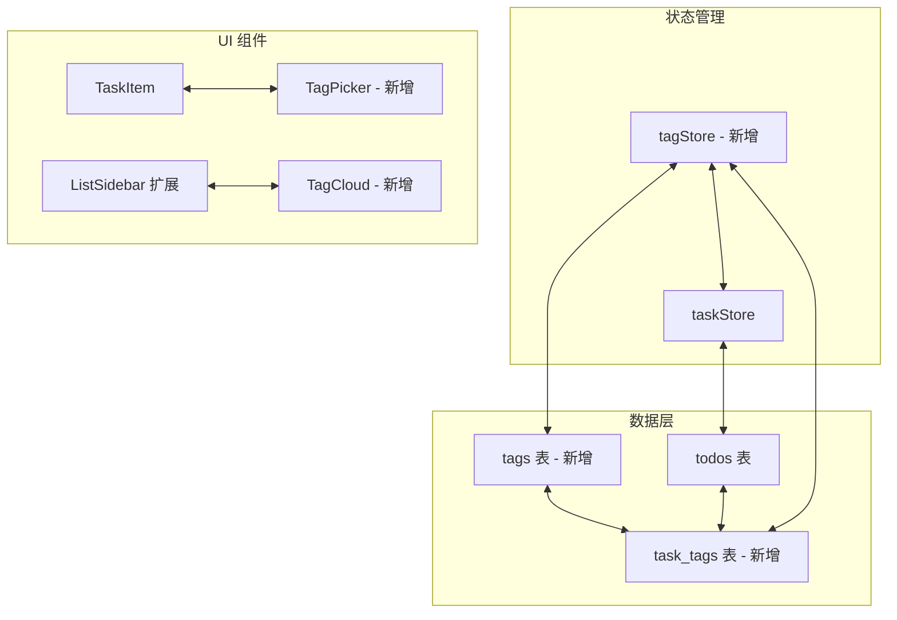
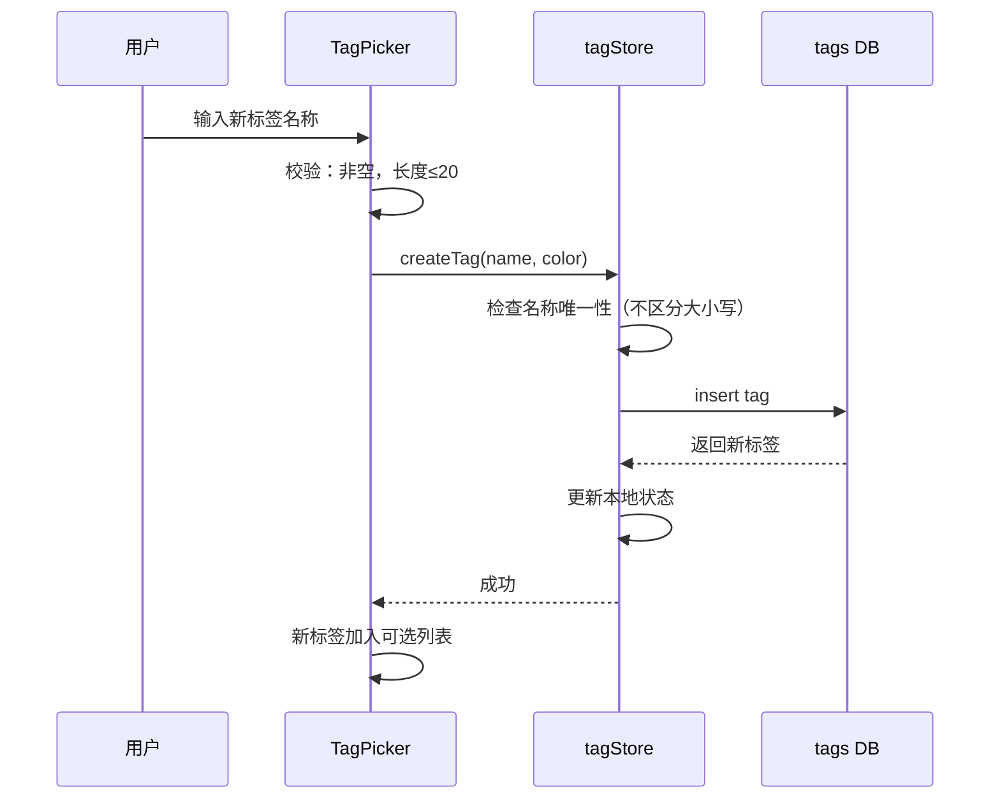
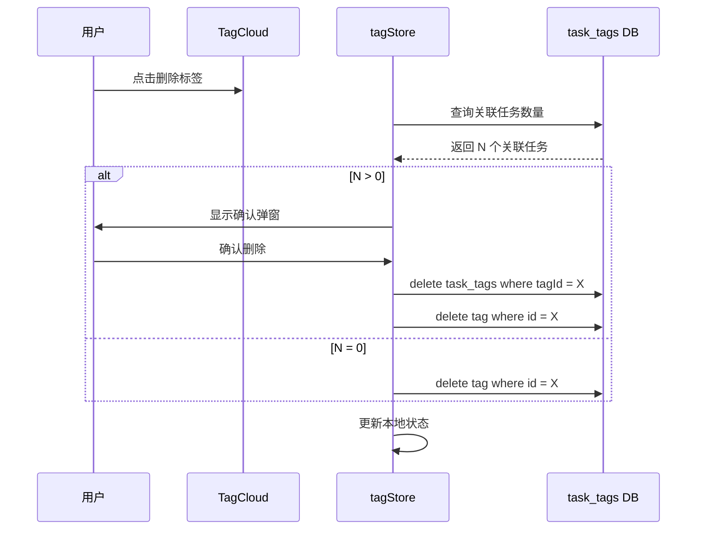

# F-002: 任务标签系统 — 技术设计文档

## 1. 设计概要

**功能描述**：为待办任务添加多维度标签系统，支持标签的创建、管理、筛选和展示

**影响范围**：数据模型（新增标签表和关联表）、UI 组件（标签选择器、标签云）、状态管理（tagStore）

**技术难点**：
- 多对多关系的数据建模和查询优化
- 标签筛选与现有分组筛选的组合逻辑
- 标签云的自动排序和展示

**外部依赖**：无

---

## 2. 架构概览

在现有任务系统基础上，新增标签数据层和状态管理层。标签通过关联表与任务建立多对多关系。



**数据流向**：
1. 用户创建标签 → tagStore → tags DB
2. 用户为任务添加标签 → tagStore → task_tags DB
3. 用户点击标签筛选 → tagStore 设置筛选条件 → taskStore 查询过滤
4. 标签云渲染 → tagStore 查询所有标签及计数 → TagCloud 展示

---

## 3. 数据库设计

### 3.1 新增表

#### `tags`

**用途**：存储所有标签定义

| 字段名 | 类型 | 约束 | 说明 |
|--------|------|------|------|
| id | string | PK, UUID | 主键 |
| name | string | NOT NULL, UNIQUE | 标签名称（不区分大小写唯一） |
| color | string | NOT NULL | 标签颜色 HEX |
| usageCount | number | DEFAULT 0 | 使用次数（冗余字段，用于排序） |
| createdAt | string | NOT NULL | 创建时间 |

**索引**：
- `name`: 唯一约束，快速查找标签 → BR-TAG-002

#### `task_tags`

**用途**：任务与标签的多对多关联表

| 字段名 | 类型 | 约束 | 说明 |
|--------|------|------|------|
| id | string | PK, UUID | 主键 |
| taskId | string | NOT NULL, FK → todos.id | 任务 ID |
| tagId | string | NOT NULL, FK → tags.id | 标签 ID |
| createdAt | string | NOT NULL | 创建时间 |

**索引**：
- `taskId`: 查询某任务的所有标签
- `tagId`: 查询某标签下的所有任务
- 复合索引 `[taskId, tagId]`: 防止重复关联

### 3.2 修改现有表

#### `todos`

**变更内容**：无需修改，标签关系通过 task_tags 关联表维护

### 3.3 数据迁移

**无需迁移**：标签系统为新增功能，不影响现有数据

---

## 4. 状态管理设计

### 4.1 tagStore

```typescript
interface TagState {
  tags: Tag[]
  taskTagMap: Record<string, string[]>  // taskId -> tagIds[]
  selectedTagIds: string[]              // 当前筛选的标签 ID 列表
  
  // 标签 CRUD
  createTag: (name: string, color: string) => Promise<Tag>
  updateTag: (id: string, updates: Partial<Tag>) => Promise<void>
  deleteTag: (id: string) => Promise<void>
  
  // 任务 - 标签关联
  addTagToTask: (taskId: string, tagId: string) => Promise<void>
  removeTagFromTask: (taskId: string, tagId: string) => Promise<void>
  
  // 筛选
  selectTag: (tagId: string) => void
  deselectTag: (tagId: string) => void
  clearTagFilter: () => void
  
  // 数据加载
  loadTags: () => Promise<void>
  loadTaskTags: (taskId: string) => Promise<string[]>
}
```

### 4.2 taskStore 修改

**新增字段**：
- `tagFilter: string[]` - 当前激活的标签筛选条件

**修改方法**：
- `getFilteredTasks()` - 在现有分组筛选基础上，增加标签筛选逻辑

```typescript
// 标签筛选逻辑（AND）
function filterByTags(tasks: Todo[], tagIds: string[]): Todo[] {
  if (tagIds.length === 0) return tasks
  
  return tasks.filter(task => {
    const taskTagIds = taskTagMap[task.id] || []
    return tagIds.every(tagId => taskTagIds.includes(tagId))
  })
}
```

---

## 5. UI 组件设计

### 5.1 TagPicker.tsx

**用途**：任务编辑时选择/创建标签

**功能**：
- 显示已有标签列表（带颜色）
- 搜索过滤已有标签
- 输入新标签名称快速创建
- 显示已选标签，可点击移除
- 限制最多 10 个标签

**Props**：
```typescript
interface TagPickerProps {
  taskId: string
  currentTagIds: string[]
  onChange: (tagIds: string[]) => void
}
```

### 5.2 TagCloud.tsx

**用途**：左侧导航栏显示标签云

**功能**：
- 显示所有标签，按使用频率排序
- 点击标签进行筛选
- 显示标签颜色和使用计数
- 支持折叠/展开

**Props**：
```typescript
interface TagCloudProps {
  selectedTagIds: string[]
  onTagSelect: (tagId: string) => void
  onTagDeselect: (tagId: string) => void
}
```

### 5.3 现有组件修改

#### TaskItem.tsx
- **改动**：任务卡片显示标签徽章（最多 3 个）
- **原因**：直观展示任务标签

#### ListSidebar.tsx
- **改动**：分组列表下方新增标签云区域
- **原因**：提供标签筛选入口

#### TaskInput.tsx / AddTaskModal.tsx
- **改动**：添加任务时支持选择标签
- **原因**：创建任务即可打标签

---

## 6. 核心逻辑

### 6.1 标签创建流程 → AC-TAG-001



### 6.2 标签筛选流程 → AC-TAG-005, AC-TAG-006

**触发条件**：用户点击标签云中的标签

**处理流程**：
1. 判断标签是否已选中
2. 已选中 → 取消选中（deselectTag）
3. 未选中 → 添加选中（selectTag）
4. taskStore 根据 selectedTagIds 过滤任务
5. 筛选逻辑：AND（任务必须包含所有选中标签）

**伪代码**：
```typescript
// tagStore
selectTag(tagId: string) {
  if (selectedTagIds.includes(tagId)) {
    deselectTag(tagId)
  } else {
    selectedTagIds.push(tagId)
  }
  applyTagFilter()
}

// taskStore
getFilteredTasks() {
  let tasks = getTasksByListId(currentListId)
  
  // 应用标签筛选（AND 逻辑）
  if (tagFilter.length > 0) {
    tasks = tasks.filter(task => {
      const taskTags = getTagsForTask(task.id)
      return tagFilter.every(tagId => taskTags.includes(tagId))
    })
  }
  
  return tasks
}
```

### 6.3 标签删除流程 → AC-TAG-010, AC-TAG-011



---

## 7. 现有代码改动

| 模块 / 文件 | 改动内容 | 原因 | 对应 AC |
|-------------|---------|------|---------|
| `src/renderer/db/types.ts` | 新增 `Tag` 和 `TaskTag` 类型定义 | 数据模型扩展 | 全部 |
| `src/renderer/db/tags.ts` | 新增标签 CRUD 操作 | 标签数据访问层 | AC-TAG-001~012 |
| `src/renderer/db/index.ts` | 新增 tags 和 task_tags 表初始化 | IndexedDB 表注册 | AC-TAG-012 |
| `src/renderer/store/tagStore.ts` | 新增标签状态管理 | 标签状态和筛选逻辑 | AC-TAG-001~012 |
| `src/renderer/store/taskStore.ts` | 修改筛选逻辑，增加标签过滤 | 支持标签筛选 | AC-TAG-005~007 |
| `src/renderer/components/TagPicker.tsx` | 新增组件 | 任务标签选择器 | AC-TAG-001~004 |
| `src/renderer/components/TagCloud.tsx` | 新增组件 | 标签云展示和筛选 | AC-TAG-008~009 |
| `src/renderer/components/TaskItem.tsx` | 新增标签徽章显示 | 任务卡片展示标签 | AC-TAG-002, AC-TAG-003 |
| `src/renderer/components/ListSidebar.tsx` | 新增标签云区域 | 左侧导航标签筛选入口 | AC-TAG-005~007 |
| `src/styles/globals.css` | 新增标签相关样式 | 标签徽章、颜色样式 | AC-TAG-002, AC-TAG-008 |

---

## 8. AC 覆盖总表

| AC 编号 | 验收标准概述 | 实现位置 |
|---------|-------------|---------|
| AC-TAG-001 | 创建新标签 | TagPicker + tagStore.createTag |
| AC-TAG-002 | 为任务添加标签 | TagPicker + tagStore.addTagToTask |
| AC-TAG-003 | 从任务移除标签 | TagPicker + tagStore.removeTagFromTask |
| AC-TAG-004 | 编辑标签信息 | TagPicker + tagStore.updateTag |
| AC-TAG-005 | 按单个标签筛选 | TagCloud + taskStore 筛选逻辑 |
| AC-TAG-006 | 按多个标签筛选 | TagCloud + taskStore AND 逻辑 |
| AC-TAG-007 | 清除标签筛选 | "全部任务"按钮 + clearTagFilter |
| AC-TAG-008 | 标签云显示 | TagCloud 组件 |
| AC-TAG-009 | 标签使用计数 | Tag 显示计数 + tagStore |
| AC-TAG-010 | 删除空标签 | TagCloud + tagStore.deleteTag |
| AC-TAG-011 | 删除有关联的标签 | TagCloud + 确认弹窗 + deleteTag |
| AC-TAG-012 | 标签数据持久化 | IndexedDB tags + task_tags 表 |

---

## 附录：变更记录

| 日期 | 变更内容 | 原因 |
|------|---------|------|
| 2026-05-01 | 初始版本 | F-002 任务标签系统技术设计 |
