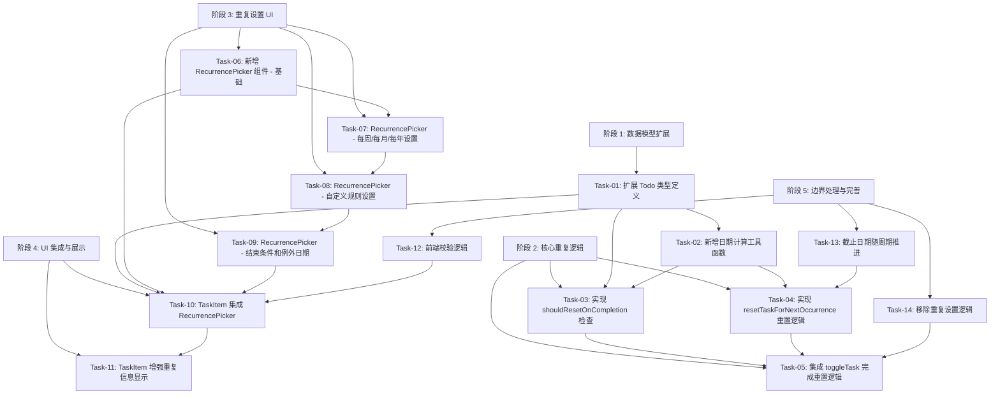

# F-005: 任务重复/周期性 — 开发任务计划

## 1. 任务概览

**总任务数**：14 个
**预计总工时**：约 300 分钟（5 小时）
**开发方法**：TDD — 每个任务按 RED → GREEN → REFACTOR 循环执行

**关键标注**：
- 🔒 阻塞任务：被多个任务依赖，建议优先完成
- ⚠️ 风险任务：技术难度高，可能需要额外时间

### 依赖关系图

### 可并行任务组

| 并行组 | 任务 | 说明 |
|--------|------|------|
| 组 1 | Task-03, Task-04, Task-06 | 核心逻辑检查、重置逻辑、UI 组件基础互不依赖 |
| 组 2 | Task-07, Task-08 | 每周/每月设置与自定义规则设置独立开发 |

---

## 2. 开发任务

### 阶段 1: 数据模型与日期计算

**阶段完成标准**：用户可以定义完整的重复规则，系统能正确计算下一个周期的日期。

---

#### Task-01: 扩展 Todo 类型定义 🔒

**通俗解释**：让系统能记住任务的各种重复规则，比如"每隔 2 周的周一"、"到 2026 年底停止"、"跳过国庆假期"。

**做什么**：
- 在 `types.ts` 中新增 `RecurrenceRule` 接口
- 扩展 `Todo` 接口，添加新的重复相关字段
- 更新 `CreateTodoInput` 类型

**涉及文件**：`src/renderer/db/types.ts`

**参考**：技术方案 §3 → AC-F005-001~004

**依赖**：无

**预估工时**：15 分钟

**验证标准**（TDD RED 阶段直接转化为测试用例）：
- [ ] RecurrenceRule 接口包含所有必需字段：pattern, interval, weeklyDays, monthlyDay, endDate, maxOccurrences, exceptionDates
- [ ] Todo 接口包含所有新字段：endDate, maxOccurrences, occurrenceCount, exceptionDates
- [ ] CreateTodoInput 类型能正确接收所有重复相关字段
- [ ] TypeScript 编译通过，无类型错误

---

#### Task-02: 新增日期计算工具函数 🔒 ⚠️

**通俗解释**：系统能根据"每隔 N 周/月/年"算出下一次应该是什么时候。

**做什么**：
- 在 `src/renderer/utils/` 中创建 `recurrence.ts`
- 实现 `calculateNextOccurrenceDate` 函数
- 实现 `clampDayOfMonth` 辅助函数
- 实现 `findNextWeekday` 和 `findNextMonthlyDay` 辅助函数

**涉及文件**：`src/renderer/utils/recurrence.ts`, `src/renderer/utils/__tests__/recurrence.test.ts`

**参考**：技术方案 §5.1 → AC-F005-001~004

**依赖**：无

**预估工时**：45 分钟

**验证标准**（TDD RED 阶段直接转化为测试用例）：
- [ ] `calculateNextOccurrenceDate('2026-05-01', { pattern: 'daily', interval: 1 })` → '2026-05-02'
- [ ] `calculateNextOccurrenceDate('2026-05-01', { pattern: 'weekly', interval: 1 })` → '2026-05-08'
- [ ] `calculateNextOccurrenceDate('2026-05-01', { pattern: 'weekly', interval: 2 })` → '2026-05-15'
- [ ] `calculateNextOccurrenceDate('2026-01-31', { pattern: 'monthly', interval: 1 })` → '2026-02-28'（月末边界处理）
- [ ] `calculateNextOccurrenceDate('2026-05-01', { pattern: 'yearly', interval: 1 })` → '2027-05-01'
- [ ] `calculateNextOccurrenceDate('2026-05-01', { pattern: 'custom', interval: 1, weeklyDays: [1, 3] })` → '2026-05-04'（下一个周一或周三）
- [ ] `clampDayOfMonth(new Date(2026, 1, 31), 31)` → 2026-02-28（2 月无 31 号）

---

### 阶段 2: 核心重复逻辑

**阶段完成标准**：用户完成任务时，系统能自动判断是否重置，并正确推进到下一个周期。

---

#### Task-03: 实现 shouldResetOnCompletion 检查逻辑 🔒

**通俗解释**：当用户点完成时，系统判断"这个任务该不该重置"。

**做什么**：
- 在 `tasks.ts` 中实现 `shouldResetOnCompletion` 函数
- 检查 `isRecurring` 是否为 true
- 检查是否达到 `endDate`
- 检查是否达到 `maxOccurrences`
- 检查当前日期是否在 `exceptionDates` 中

**涉及文件**：`src/renderer/db/tasks.ts`

**参考**：技术方案 §5.2, §5.4, §5.5 → AC-F005-005~008

**依赖**：Task-01

**预估工时**：30 分钟

**验证标准**（TDD RED 阶段直接转化为测试用例）：
- [ ] 非重复任务（isRecurring=false）→ 返回 false
- [ ] 重复任务，无结束条件 → 返回 true
- [ ] 重复任务，当前日期 >= endDate → 返回 false
- [ ] 重复任务，occurrenceCount >= maxOccurrences → 返回 false
- [ ] 重复任务，当前日期在 exceptionDates 中 → 返回 false
- [ ] 重复任务，当前日期不在 exceptionDates 中 → 返回 true

---

#### Task-04: 实现 resetTaskForNextOccurrence 重置逻辑 🔒

**通俗解释**：系统把已完成的任务"翻篇"，变成未完成的下一个周期任务。

**做什么**：
- 在 `tasks.ts` 中实现 `resetTaskForNextOccurrence` 函数
- 将 `completed` 设为 false
- 计算下一个周期日期并更新 `dueDate`（如有）
- 增加 `occurrenceCount`
- 更新 `updatedAt`
- 清除 `lastCompletedDate`

**涉及文件**：`src/renderer/db/tasks.ts`

**参考**：技术方案 §5.2 → AC-F005-009

**依赖**：Task-01, Task-02

**预估工时**：30 分钟

**验证标准**（TDD RED 阶段直接转化为测试用例）：
- [ ] 输入已完成任务（completed=true, dueDate='2026-05-01', occurrenceCount=0, pattern='daily'）→ 输出 completed=false, dueDate='2026-05-02', occurrenceCount=1
- [ ] 输入任务无 dueDate → dueDate 保持 null
- [ ] occurrenceCount 从 5 变为 6
- [ ] updatedAt 更新为当前时间
- [ ] lastCompletedDate 变为 null

---

#### Task-05: 集成 toggleTask 完成重置逻辑

**通俗解释**：用户点完成时，如果任务该重置，就自动翻篇而不是保持完成。

**做什么**：
- 修改 `taskStore.ts` 中的 `toggleTask` 方法
- 在标记完成前调用 `shouldResetOnCompletion`
- 如果需要重置，调用 `resetTaskForNextOccurrence`
- 如果不需要重置，正常标记完成

**涉及文件**：`src/renderer/store/taskStore.ts`, `src/renderer/db/tasks.ts`

**参考**：技术方案 §5.2 → AC-F005-009, AC-F005-010

**依赖**：Task-03, Task-04

**预估工时**：30 分钟

**验证标准**（TDD RED 阶段直接转化为测试用例）：
- [ ] 用户完成每日重复任务 → 任务变为未完成，dueDate 推进到明天
- [ ] 用户完成非重复任务 → 任务正常标记为完成
- [ ] 用户完成已达到 endDate 的重复任务 → 任务正常标记为完成（不重置）
- [ ] 用户完成已达到 maxOccurrences 的重复任务 → 任务正常标记为完成（不重置）
- [ ] 用户完成 exceptionDates 中的任务 → 任务推进到下一个有效日期

---

### 阶段 3: 重复设置 UI

**阶段完成标准**：用户可以通过直观的界面设置各种重复规则，包括频率、间隔、结束条件和例外日期。

---

#### Task-06: 新增 RecurrencePicker 组件 - 基础 🔒

**通俗解释**：用户在编辑任务时看到一个重复设置面板，可以选择"每天/每周/每月/每年"重复。

**做什么**：
- 创建 `RecurrencePicker.tsx` 组件
- 实现重复频率选择（每日/每周/每月/每年/自定义/无）
- 实现基本的保存和取消逻辑
- 组件通过 props 接收当前任务的重复设置

**涉及文件**：`src/renderer/components/RecurrencePicker.tsx`

**参考**：技术方案 §6 → AC-F005-001

**依赖**：无

**预估工时**：30 分钟

**验证标准**（TDD RED 阶段直接转化为测试用例）：
- [ ] 组件渲染时显示 6 个频率选项：每日/每周/每月/每年/自定义/无
- [ ] 点击频率选项时高亮选中
- [ ] 点击保存时调用 onChange 回调并传递选中的频率
- [ ] 点击取消时不调用 onChange 回调
- [ ] 任务当前有重复设置时，对应选项默认选中

---

#### Task-07: RecurrencePicker - 每周/每月/每年设置

**通俗解释**：选择每周时，用户能选择周一到周日中的几天；选择每月时能选择几号。

**做什么**：
- 每周：显示 7 个星期多选按钮
- 每月：显示 1-31 的日期选择器
- 每年：显示月日选择（可选，简化为固定日期）
- 间隔设置：输入框设置"每隔 N 周/月/年"

**涉及文件**：`src/renderer/components/RecurrencePicker.tsx`

**参考**：技术方案 §6 → AC-F005-002~004

**依赖**：Task-06

**预估工时**：45 分钟

**验证标准**（TDD RED 阶段直接转化为测试用例）：
- [ ] 选择每周后显示星期选择器，点击周一、周三选中
- [ ] 未选择任何星期时保存按钮禁用
- [ ] 选择每月后显示 1-31 日期选择器，点击 15 号选中
- [ ] 间隔输入框只能输入大于 0 的正整数
- [ ] 输入 0 或负数时显示错误提示
- [ ] 保存时传递完整的每周/每月规则数据

---

#### Task-08: RecurrencePicker - 自定义规则设置

**通俗解释**：用户能设置"每隔 2 周的周一"或"每月 15 号"等复杂规则。

**做什么**：
- 自定义面板：选择频率类型（周/月）
- 设置间隔数字
- 设置具体规则（星期/日期）
- 校验逻辑：间隔必须 > 0，至少选择一个星期或日期

**涉及文件**：`src/renderer/components/RecurrencePicker.tsx`

**参考**：技术方案 §6 → AC-F005-003, AC-F005-004

**依赖**：Task-07

**预估工时**：30 分钟

**验证标准**（TDD RED 阶段直接转化为测试用例）：
- [ ] 选择自定义后显示频率类型下拉（周/月）
- [ ] 选择周后显示星期选择器和间隔输入框
- [ ] 选择月后显示日期选择器和间隔输入框
- [ ] 未设置有效规则时保存按钮禁用
- [ ] 保存时传递完整的自定义规则数据

---

#### Task-09: RecurrencePicker - 结束条件和例外日期

**通俗解释**：用户能设置"到 2026 年底停止重复"或"跳过国庆假期"。

**做什么**：
- 结束条件：单选按钮组（无结束/结束日期/最大次数）
- 结束日期选择器
- 最大次数数字输入框
- 例外日期：日历选择器添加/删除
- 结束日期和最大次数互斥

**涉及文件**：`src/renderer/components/RecurrencePicker.tsx`

**参考**：技术方案 §6 → AC-F005-005~008

**依赖**：Task-08

**预估工时**：45 分钟

**验证标准**（TDD RED 阶段直接转化为测试用例）：
- [ ] 选择"无结束"时，结束日期和最大次数输入框隐藏
- [ ] 选择"结束日期"时显示日期选择器，选择 2026-12-31
- [ ] 选择"最大次数"时显示数字输入框，输入 10
- [ ] 先选择结束日期再选择最大次数 → 结束日期清除
- [ ] 结束日期早于创建日期时显示错误提示
- [ ] 添加例外日期后显示在列表中
- [ ] 点击例外日期列表中的删除按钮移除该日期
- [ ] 例外日期早于创建日期时无法添加

---

### 阶段 4: UI 集成与展示

**阶段完成标准**：用户可以在任务编辑模式下设置重复规则，并在任务卡片上看到重复信息。

---

#### Task-10: TaskItem 集成 RecurrencePicker

**通俗解释**：用户双击任务编辑时，能看到一个"重复"按钮，点击弹出重复设置面板。

**做什么**：
- 在 `TaskItem.tsx` 编辑模式下添加"重复"按钮
- 点击按钮打开 RecurrencePicker 弹窗/面板
- 保存后调用 `updateTaskContent` 更新任务
- 处理校验错误显示

**涉及文件**：`src/renderer/components/TaskItem.tsx`

**参考**：技术方案 §6 → AC-F005-001

**依赖**：Task-01, Task-06, Task-09

**预估工时**：30 分钟

**验证标准**（TDD RED 阶段直接转化为测试用例）：
- [ ] 编辑模式下显示"重复"按钮
- [ ] 点击按钮弹出 RecurrencePicker
- [ ] 选择频率并保存 → 任务更新重复设置
- [ ] 选择"无"并保存 → 任务清除重复设置
- [ ] 任务已有重复设置时，RecurrencePicker 显示当前设置
- [ ] 校验错误时显示错误提示

---

#### Task-11: TaskItem 增强重复信息显示

**通俗解释**：任务卡片上不仅显示"🔄 每日"，还显示更详细的重复信息，比如"🔄 每周周一、周三"。

**做什么**：
- 修改重复信息显示逻辑
- 根据 recurrenceRule 生成人类可读的描述文本
- 显示例外日期数量（如有）
- 显示结束条件（如有）

**涉及文件**：`src/renderer/components/TaskItem.tsx`

**参考**：技术方案 §6 → AC-F005-010

**依赖**：Task-10

**预估工时**：20 分钟

**验证标准**（TDD RED 阶段直接转化为测试用例）：
- [ ] 每日重复任务显示"🔄 每日"
- [ ] 每周周一、周三重复显示"🔄 每周周一、周三"
- [ ] 每月 15 号重复显示"🔄 每月 15 号"
- [ ] 有例外日期时显示"+N 个例外日期"
- [ ] 有结束日期时显示"至 2026-12-31"

---

### 阶段 5: 边界处理与完善

**阶段完成标准**：所有边界情况和异常处理都得到妥善处理。

---

#### Task-12: 前端校验逻辑

**通俗解释**：用户输入错误时（如间隔为 0、结束日期早于创建日期），系统会给出提示并阻止保存。

**做什么**：
- 实现 `validateRecurrenceRule` 函数
- 校验间隔 > 0
- 校验结束日期 >= 创建日期
- 校验例外日期 >= 创建日期
- 校验至少选择一个星期（每周模式）
- 在 RecurrencePicker 和 TaskItem 中集成校验

**涉及文件**：`src/renderer/utils/recurrence.ts`, `src/renderer/components/RecurrencePicker.tsx`

**参考**：技术方案 §8 → AC-F005-011, AC-F005-012, AC-F005-014, AC-F005-016

**依赖**：无

**预估工时**：20 分钟

**验证标准**（TDD RED 阶段直接转化为测试用例）：
- [ ] 间隔为 0 → 返回错误"间隔必须大于 0"
- [ ] 间隔为 -1 → 返回错误"间隔必须大于 0"
- [ ] 结束日期早于创建日期 → 返回错误"结束日期不能早于任务创建日期"
- [ ] 例外日期早于创建日期 → 返回错误"例外日期不能早于任务创建日期"
- [ ] 每周模式未选择任何星期 → 返回错误"请至少选择一个星期"
- [ ] 所有校验通过 → 返回 null

---

#### Task-13: 截止日期随周期推进

**通俗解释**：如果任务有截止日期，完成任务后截止日期自动变成下一个周期的同一天。

**做什么**：
- 在 `resetTaskForNextOccurrence` 中实现 dueDate 推进逻辑
- 使用 `calculateNextOccurrenceDate` 计算新的 dueDate
- 确保原有的 reminder 设置保留

**涉及文件**：`src/renderer/db/tasks.ts`

**参考**：技术方案 §5.2 → AC-F005-023

**依赖**：Task-04

**预估工时**：15 分钟

**验证标准**（TDD RED 阶段直接转化为测试用例）：
- [ ] 任务有 dueDate='2026-05-01'，每日重复 → 重置后 dueDate='2026-05-02'
- [ ] 任务有 dueDate='2026-05-01'，每周重复 → 重置后 dueDate='2026-05-08'
- [ ] 任务有 dueDate='2026-01-31'，每月重复 → 重置后 dueDate='2026-02-28'
- [ ] 任务无 dueDate → 重置后 dueDate 保持 null
- [ ] reminder 保持不变

---

#### Task-14: 移除重复设置逻辑

**通俗解释**：用户把重复频率设置为"无"时，清除所有重复相关设置。

**做什么**：
- 在 `updateTaskContent` 中处理移除重复设置
- 清除 recurrencePattern, recurrenceRule, endDate, maxOccurrences, occurrenceCount, exceptionDates
- 保持 isRecurring 为 false

**涉及文件**：`src/renderer/store/taskStore.ts`, `src/renderer/db/tasks.ts`

**参考**：技术方案 §6 → AC-F005-015

**依赖**：Task-05

**预估工时**：15 分钟

**验证标准**（TDD RED 阶段直接转化为测试用例）：
- [ ] 任务有完整重复设置，设置频率为"无" → 所有重复相关字段清除
- [ ] 任务变为非重复任务
- [ ] endDate, maxOccurrences, exceptionDates 全部变为 null/[]
- [ ] occurrenceCount 变为 0

---

## 3. AC 覆盖总表

| AC 编号 | 验收标准概述 | 承接任务 | 验证方式 |
|---------|-------------|---------|---------|
| AC-F005-001 | 设置任务重复频率 | Task-01, Task-06, Task-10 | 用户选择频率后保存，任务显示重复图标 |
| AC-F005-002 | 每周重复具体设置 | Task-07, Task-10 | 选择周一、周三后保存，任务设置正确 |
| AC-F005-003 | 自定义重复间隔 | Task-02, Task-08, Task-10 | 设置每隔 2 周后保存，任务设置正确 |
| AC-F005-004 | 自定义每月重复日期 | Task-02, Task-08, Task-10 | 设置每月 15 号后保存，任务设置正确 |
| AC-F005-005 | 设置重复结束日期 | Task-09, Task-03 | 设置结束日期后，到期不再重置 |
| AC-F005-006 | 设置最大重复次数 | Task-09, Task-03 | 设置最大次数后，到期不再重置 |
| AC-F005-007 | 添加例外日期 | Task-09, Task-03 | 添加例外日期后，该日期不重置 |
| AC-F005-008 | 删除例外日期 | Task-09 | 删除例外日期后，该日期恢复正常重置 |
| AC-F005-009 | 完成任务并重置 | Task-05, Task-04 | 完成任务后任务变为未完成，日期推进 |
| AC-F005-010 | 查看重复任务信息 | Task-11 | 任务卡片显示重复图标和描述 |
| AC-F005-011 | 结束日期早于创建日期 | Task-12 | 显示错误提示，阻止保存 |
| AC-F005-012 | 自定义间隔为 0 或负数 | Task-12 | 显示错误提示，阻止保存 |
| AC-F005-013 | 每月重复日期超出月份范围 | Task-02 | 自动调整为该月最后一天 |
| AC-F005-014 | 所有星期都未选择 | Task-12 | 显示错误提示，阻止保存 |
| AC-F005-015 | 移除重复设置 | Task-14 | 所有重复相关字段清除 |
| AC-F005-016 | 例外日期早于创建日期 | Task-12 | 显示错误提示，阻止添加 |
| AC-F005-017 | 同时设置结束日期和最大次数 | Task-09 | 清除已设置的，只保留新设置的 |
| AC-F005-018 | 非重复任务无结束条件 | Task-09 | 相关设置项禁用 |
| AC-F005-019 | 自定义间隔必须大于 0 | Task-12 | 只能输入大于 0 的正整数 |
| AC-F005-020 | 每月日期不超过月份最大天数 | Task-02 | 重置时自动调整 |
| AC-F005-021 | 例外日期不早于创建日期 | Task-12 | 早于创建日期的日期不可添加 |
| AC-F005-022 | 结束日期不早于创建日期 | Task-12 | 早于创建日期的日期禁用 |
| AC-F005-023 | 截止日期随周期推进 | Task-13 | 重置后 dueDate 推进到下一个周期 |
| AC-F005-024 | 例外日期自动跳过 | Task-05, Task-03 | 完成任务时推进到下一个有效日期 |

---

## 4. 完成定义

- [ ] 所有 14 个任务的验证标准（测试用例）通过
- [ ] AC 覆盖总表中 24 条 AC 的验证方式已执行并通过
- [ ] RecurrencePicker 组件在 TaskItem 编辑模式下正常工作
- [ ] 完成每日/每周/每月/每年/自定义重复任务后自动重置并推进日期
- [ ] 结束条件（endDate/maxOccurrences）正确阻止重置
- [ ] 例外日期正确跳过
- [ ] 每月月末边界正确处理（如 31 号在 2 月变为 28/29）
- [ ] 截止日期随周期正确推进
- [ ] 移除重复设置时所有相关字段正确清除
- [ ] TypeScript 编译通过，无类型错误
- [ ] 现有测试用例全部通过（回归测试）
