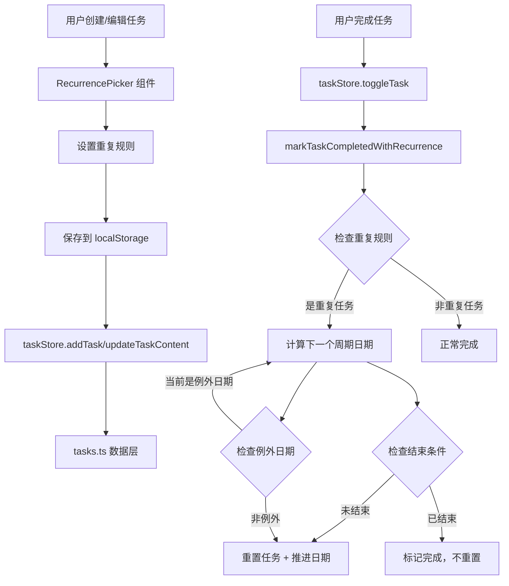
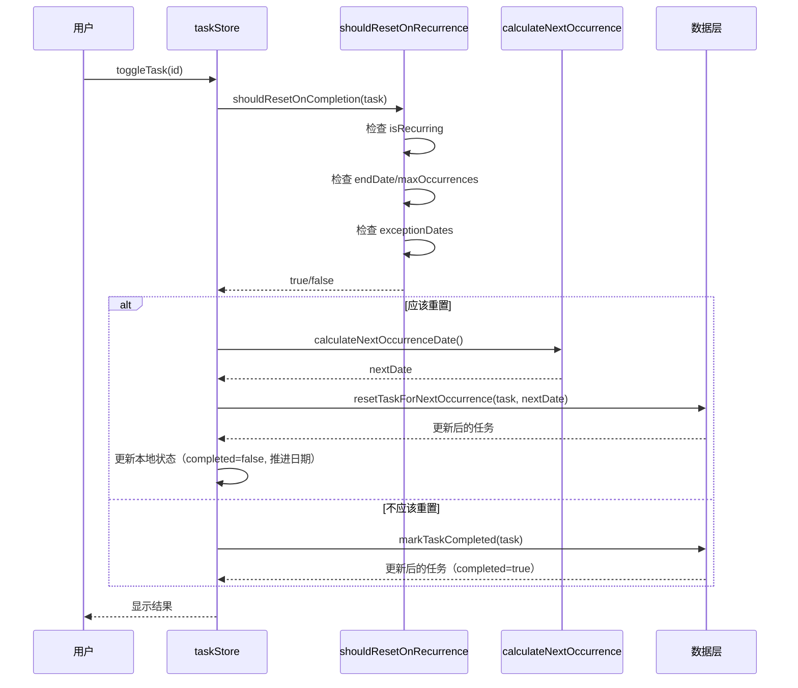

# F-005: 任务重复/周期性 — 技术设计文档

## 1. 设计概要

**功能描述**：为任务设置周期性重复规则（每日/每周/每月/每年/自定义），完成任务后自动推进到下一个周期，支持结束条件和例外日期。

**影响范围**：任务数据模型（types）、任务数据层（tasks.ts）、任务状态管理（taskStore.ts）、任务编辑 UI（TaskItem.tsx、AddTaskModal.tsx）、新增 RecurrencePicker 组件

**技术难点**：
- 复杂的重复日期计算逻辑（尤其是每月 31 号在不同月份的处理、自定义间隔计算）
- 例外日期的自动跳过逻辑
- 前端日期推进算法与现有每日重置逻辑的融合

**外部依赖**：无（纯前端实现，不需要后端）

---

## 2. 架构概览

F-005 采用纯前端实现，所有逻辑在渲染进程中完成。核心模块交互如下：



---

## 3. 数据库设计

### 修改现有数据模型

#### Todo 接口扩展（`types.ts`）

**变更内容**：在现有 Todo 接口中新增重复相关字段，扩展现有模型。

现有字段已包含：
- `isRecurring`: boolean
- `recurrencePattern`: RecurrencePattern
- `lastCompletedDate`: string | null
- `originalTaskId`: string | null

**需要新增/修改的字段**：

| 字段名 | 类型 | 说明 |
|--------|------|------|
| recurrencePattern | RecurrencePattern \| RecurrenceRule | 从简单的 enum 扩展为支持自定义规则对象 |
| endDate | string \| null | 重复结束日期（ISO 8601） |
| maxOccurrences | number \| null | 最大重复次数 |
| occurrenceCount | number | 已重复次数（默认 0） |
| exceptionDates | string[] | 例外日期列表（ISO 日期格式 YYYY-MM-DD） |

**新的 RecurrenceRule 类型**：

```typescript
export type RecurrencePattern = 'daily' | 'weekly' | 'monthly' | 'yearly' | 'custom' | null

export interface RecurrenceRule {
  pattern: RecurrencePattern
  interval: number           // 间隔，如每隔 2 周则为 2
  weeklyDays?: number[]      // 每周的星期几（0-6，0=周日）
  monthlyDay?: number        // 每月的几号（1-31）
  endDate?: string | null    // 结束日期
  maxOccurrences?: number | null // 最大重复次数
  exceptionDates?: string[]  // 例外日期列表
}
```

**兼容性说明**：保持向后兼容，现有的 `isRecurring` 字段保留用于快速判断，新的详细规则存储在 `recurrenceRule` 对象中。

**数据迁移**：无需迁移。现有的每日重复任务在 `recurrencePattern` 中已设置为 'daily'，新字段均为可选，默认为 null/0/[]。

---

## 4. API 设计

由于项目使用 localStorage 存储，没有传统意义上的 API。这里定义数据层的函数接口。

### `createTask(input: CreateTaskInput): Promise<Todo>`

**描述**：创建任务，支持重复规则 → AC-F005-001

**输入**：
```typescript
{
  content: string
  listId?: string
  isRecurring?: boolean
  recurrencePattern?: RecurrencePattern
  recurrenceRule?: RecurrenceRule  // 新增
  dueDate?: string | null
  // ... 其他字段
}
```

**输出**：完整的 Todo 对象，包含所有重复相关字段。

---

### `updateTask(id: string, updates: Partial<Todo>): Promise<Todo>`

**描述**：更新任务，包括修改重复规则 → AC-F005-001, AC-F005-002

**输入**：任务 ID 和要更新的字段（可包含重复规则相关字段）。

**输出**：更新后的完整 Todo 对象。

---

### `calculateNextOccurrenceDate(currentDate: string, rule: RecurrenceRule): string | null`

**描述**：根据当前日期和重复规则计算下一个周期的日期 → AC-F005-009

**输入**：
```typescript
{
  currentDate: string  // ISO 8601 日期
  rule: RecurrenceRule // 重复规则
}
```

**输出**：下一个周期的日期（ISO 8601），如果无法计算或已结束则返回 null。

---

### `shouldResetOnCompletion(task: Todo): boolean`

**描述**：判断任务完成时是否应该重置 → AC-F005-010

**逻辑**：
1. 检查 `isRecurring` 是否为 true
2. 检查是否达到 `endDate` 或 `maxOccurrences`
3. 检查当前日期是否在 `exceptionDates` 中
4. 如果通过所有检查，返回 true

---

### `resetTaskForNextOccurrence(task: Todo): Todo`

**描述**：重置任务到下一个周期 → AC-F005-009

**逻辑**：
1. 将 `completed` 设为 false
2. 计算下一个周期日期
3. 更新 `dueDate`（如有）到下一个周期
4. 增加 `occurrenceCount`
5. 更新 `updatedAt`

---

## 5. 核心逻辑

### 5.1 重复日期计算引擎 → AC-F005-001 ~ AC-F005-004

**触发条件**：用户完成任务时，需要计算下一个周期的日期。

**处理流程**：
1. 获取任务的 `recurrenceRule`
2. 根据 `pattern` 类型选择计算策略
3. 返回下一个有效日期

**日期计算策略**：

| Pattern | 计算逻辑 |
|---------|---------|
| daily | 当前日期 + 1 天 |
| weekly | 当前日期 + `interval` 周 |
| monthly | 当前日期的下一个月 + `interval` 个月，保持相同的日期号 |
| yearly | 当前日期的下一年 + `interval` 年，保持相同的月日 |
| custom | 根据具体规则（weeklyDays、monthlyDay）计算 |

**伪代码**：

```typescript
function calculateNextOccurrenceDate(currentDate: string, rule: RecurrenceRule): string | null {
  const date = new Date(currentDate)
  
  switch (rule.pattern) {
    case 'daily':
      return addDays(date, 1)
      
    case 'weekly':
      return addWeeks(date, rule.interval || 1)
      
    case 'monthly':
      const nextMonth = addMonths(date, rule.interval || 1)
      // 处理月末边界（如 31 号在 2 月变成 28/29）→ AC-F005-013
      return clampDayOfMonth(nextMonth, date.getDate())
      
    case 'yearly':
      const nextYear = addYears(date, rule.interval || 1)
      return clampDayOfMonth(nextYear, date.getDate())
      
    case 'custom':
      if (rule.weeklyDays && rule.weeklyDays.length > 0) {
        return findNextWeekday(date, rule.weeklyDays, rule.interval)
      }
      if (rule.monthlyDay) {
        return findNextMonthlyDay(date, rule.monthlyDay, rule.interval)
      }
      return null
  }
}
```

---

### 5.2 完成时的重置逻辑 → AC-F005-009, AC-F005-010

**触发条件**：用户标记任务完成。

**处理流程**：


**关键逻辑**：
1. `shouldResetOnCompletion` 返回 true 时：重置任务，不标记为完成
2. `shouldResetOnCompletion` 返回 false 时：正常标记为完成
3. 如果当前日期是例外日期，跳过并计算下一个有效周期 → AC-F005-024

---

### 5.3 每月边界处理 → AC-F005-013, BR-F005-003

**问题**：如果任务设置为每月 31 号重复，但某些月份没有 31 号（如 2 月、4 月等）。

**解决方案**：使用 `clampDayOfMonth` 函数，将日期调整为该月的最后一天。

```typescript
function clampDayOfMonth(date: Date, targetDay: number): Date {
  const year = date.getFullYear()
  const month = date.getMonth()
  const lastDayOfMonth = new Date(year, month + 1, 0).getDate()
  
  const actualDay = Math.min(targetDay, lastDayOfMonth)
  return new Date(year, month, actualDay)
}
```

---

### 5.4 结束条件检查 → AC-F005-005, AC-F005-006

**检查项**：
1. **endDate**：如果当前日期 >= endDate，不再重置
2. **maxOccurrences**：如果 `occurrenceCount >= maxOccurrences`，不再重置
3. 两者互斥，同时设置时只使用一个（优先使用 endDate）

---

### 5.5 例外日期处理 → AC-F005-007, AC-F005-008, BR-F005-007

**逻辑**：
1. 任务完成时，检查当前日期是否在 `exceptionDates` 中
2. 如果是例外日期，递归调用 `calculateNextOccurrenceDate` 直到找到非例外日期
3. 设置一个安全上限（如 365 次递归），防止无限循环

```typescript
function findNextValidDate(date: string, rule: RecurrenceRule, maxIterations: number = 365): string | null {
  let currentDate = date
  let iterations = 0
  
  while (iterations < maxIterations) {
    if (!rule.exceptionDates?.includes(currentDate.split('T')[0])) {
      return currentDate
    }
    currentDate = calculateNextOccurrenceDate(currentDate, rule)
    if (!currentDate) return null
    iterations++
  }
  
  return null // 超过最大迭代次数
}
```

---

## 6. 现有代码改动

| 模块 / 文件 | 改动内容 | 原因 | 对应 AC |
|-------------|---------|------|---------|
| `db/types.ts` | 新增 RecurrenceRule 接口，扩展 Todo 接口 | 支持自定义重复规则 | AC-F005-001~004 |
| `db/tasks.ts` | 新增日期计算、重置、检查函数 | 实现重复任务核心逻辑 | AC-F005-005~010 |
| `store/taskStore.ts` | 修改 toggleTask 逻辑，集成重置检查 | 完成任务时触发重置 | AC-F005-009 |
| `components/TaskItem.tsx` | 修改编辑模式，添加 RecurrencePicker 入口 | 用户设置重复规则 | AC-F005-001 |
| `components/TaskItem.tsx` | 扩展重复图标显示逻辑 | 显示详细的重复信息 | AC-F005-010 |
| `components/AddTaskModal.tsx` | 可选：添加重复设置（视需求决定） | 创建任务时设置重复 | AC-F005-001 |
| **新组件** `RecurrencePicker.tsx` | 新增重复规则选择器组件 | 用户友好的重复设置 UI | AC-F005-001~004 |

---

## 7. 技术决策

### 7.1 日期库选择

**背景**：需要复杂的日期计算（加减周/月/年、月末处理、星期计算）。

**选项**：
- A: 使用 `date-fns` — 轻量、模块化、Tree-shaking 友好
- B: 使用 `dayjs` — 轻量、API 类似 moment、插件系统
- C: 手写原生 Date 操作 — 无依赖但容易出错

**结论**：选 A（date-fns），项目已有 date-fns 依赖，且 API 清晰、类型支持好。

### 7.2 重置模式 vs 创建新任务模式

**背景**：完成任务后有两种处理方式：重置当前任务或创建新任务。

**选项**：
- A: 重置模式 — 标记完成后再重置为未完成，保持同一任务 ID
- B: 创建模式 — 完成后创建新任务，保留历史

**结论**：选 A（重置模式），用户确认采用现有逻辑。保持简单，避免数据膨胀。

### 7.3 重复规则存储结构

**背景**：需要设计重复规则的存储格式。

**选项**：
- A: 扁平字段（isRecurring, recurrencePattern, weeklyDays, monthlyDay 等）
- B: 嵌套对象（recurrenceRule: { pattern, interval, weeklyDays, ... }）

**结论**：选 A（扁平字段），与现有代码风格一致，简化数据访问。将新字段直接添加到 Todo 接口中。

---

## 8. 安全与性能

**输入校验**：
- 重复间隔必须 > 0
- 结束日期必须 >= 任务创建日期
- 例外日期必须 >= 任务创建日期
- 每月重复日期不能超过该月最大天数

**性能考量**：
- 例外日期查找设置 365 次递归上限，防止极端情况下的性能问题
- 日期计算函数使用纯函数，无副作用，便于缓存和测试
- 所有操作在 localStorage 层面完成，无网络请求

---

## 9. AC 覆盖总表

| AC 编号 | 验收标准概述 | 实现位置 |
|---------|-------------|---------|
| AC-F005-001 | 设置任务重复频率 | RecurrencePicker + types.ts + tasks.ts |
| AC-F005-002 | 每周重复具体设置 | RecurrencePicker（星期多选器）|
| AC-F005-003 | 自定义重复间隔 | RecurrencePicker + calculateNextOccurrenceDate |
| AC-F005-004 | 自定义每月重复日期 | RecurrencePicker + calculateNextOccurrenceDate |
| AC-F005-005 | 设置重复结束日期 | RecurrencePicker + shouldResetOnCompletion |
| AC-F005-006 | 设置最大重复次数 | RecurrencePicker + shouldResetOnCompletion |
| AC-F005-007 | 添加例外日期 | RecurrencePicker + 例外日期列表 |
| AC-F005-008 | 删除例外日期 | RecurrencePicker + 例外日期管理 |
| AC-F005-009 | 完成任务并重置 | taskStore.toggleTask + resetTaskForNextOccurrence |
| AC-F005-010 | 查看重复任务信息 | TaskItem.tsx（重复图标和信息显示）|
| AC-F005-011 | 结束日期早于创建日期 | 前端校验 + RecurrencePicker |
| AC-F005-012 | 自定义间隔为 0 或负数 | 前端校验 + RecurrencePicker |
| AC-F005-013 | 每月重复日期超出月份范围 | calculateNextOccurrenceDate + clampDayOfMonth |
| AC-F005-014 | 所有星期都未选择 | 前端校验 + RecurrencePicker |
| AC-F005-015 | 移除重复设置 | RecurrencePicker + tasks.ts |
| AC-F005-016 | 例外日期早于创建日期 | 前端校验 + RecurrencePicker |
| AC-F005-017 | 同时设置结束日期和最大次数 | 前端逻辑（互斥选择）|
| AC-F005-018 | 非重复任务无结束条件 | RecurrencePicker（禁用逻辑）|
| AC-F005-019 | 自定义间隔必须大于 0 | RecurrencePicker 输入限制 |
| AC-F005-020 | 每月日期不超过月份最大天数 | calculateNextOccurrenceDate + clampDayOfMonth |
| AC-F005-021 | 例外日期不早于创建日期 | RecurrencePicker 日期选择器 |
| AC-F005-022 | 结束日期不早于创建日期 | RecurrencePicker 日期选择器 |
| AC-F005-023 | 截止日期随周期推进 | resetTaskForNextOccurrence |
| AC-F005-024 | 例外日期自动跳过 | findNextValidDate + shouldResetOnCompletion |

---

## 附录：变更记录

| 日期 | 变更内容 | 原因 |
|------|---------|------|
| 2026-05-01 | 初始版本 | F-005 任务重复功能技术设计 |
