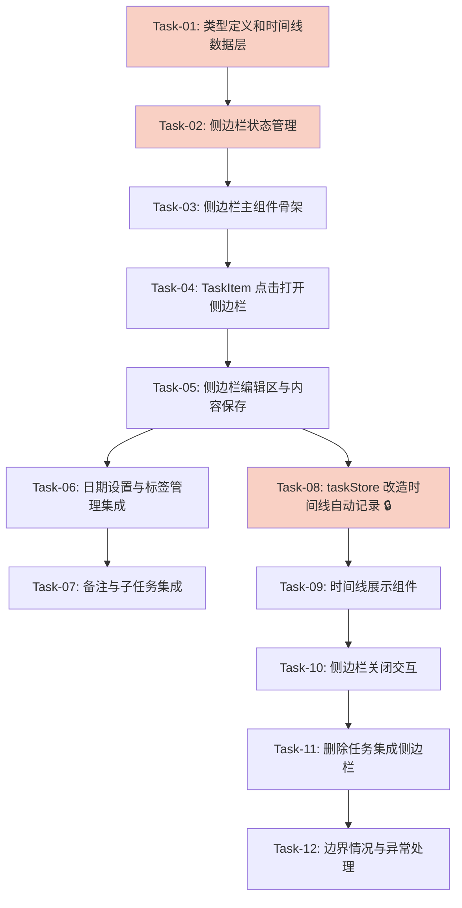

# F-007: 任务详情侧边栏 — 开发任务计划

## 1. 任务概览

**总任务数**：12 个
**预计总工时**：约 480 分钟（约 8 小时）
**开发方法**：TDD — 每个任务按 RED → GREEN → REFACTOR 循环执行

**关键标注**：
- 🔒 阻塞任务：被多个任务依赖，建议优先完成
- ⚠️ 风险任务：技术难度高，可能需要额外时间

### 依赖关系图

### 可并行任务组

| 并行组 | 任务 | 说明 |
|--------|------|------|
| 组一 | Task-05, Task-06, Task-07 | 侧边栏各功能模块集成彼此独立，可并行开发 |

---

## 2. 开发任务

> 按垂直切片组织。每个阶段对应一个可独立运行和验证的用户行为。

### 阶段一：侧边栏打开/关闭/状态管理

**阶段完成标准**：用户点击任务后，右侧滑出侧边栏，显示任务基本信息（内容、日期、标签等），任务列表中该任务显示高亮状态；点击外部区域、ESC 键、关闭按钮可以关闭侧边栏；重复点击同一任务不重新加载，点击不同任务切换内容。

---

#### Task-01: 新增 Todo.notes 字段和时间线数据层 🔒

**通俗解释**：为任务增加"备注"能力，并建立时间线数据的存储和查询功能，让后续所有操作记录有地方可存。

**做什么**：
- 在 `db/types.ts` 中为 `Todo` 接口新增 `notes: string | null` 字段
- 创建 `db/timeline.ts` 文件，实现时间线数据的 CRUD 操作
- 导出 `addTimelineEntry`、`getTimelineByTaskId`、`deleteTimelineByTaskId` 三个方法

**涉及文件**：`db/types.ts`、`db/timeline.ts`、`db/index.ts`

**参考**：技术方案 3、4 章节 → AC-012, AC-023, AC-024

**依赖**：无

**预估工时**：40 分钟

**验证标准**（TDD RED 阶段直接转化为测试用例）：
- [x] `addTimelineEntry` 传入 taskId 和 actionType → 返回新记录，包含 id、taskId、actionType、createdAt
- [x] `addTimelineEntry` 传入 beforeValue 和 afterValue → 记录中 beforeValue/afterValue 为 JSON 字符串
- [x] `addTimelineEntry` 不传 beforeValue/afterValue → 记录中这两个字段为 null
- [x] `getTimelineByTaskId` 传入已存在 taskId → 返回该任务的所有时间线记录
- [x] `getTimelineByTaskId` 传入不存在 taskId → 返回空数组
- [x] `getTimelineByTaskId` 返回结果按 createdAt 倒序排序
- [x] `deleteTimelineByTaskId` 传入 taskId → 该任务的所有时间线记录被删除
- [x] 多次调用 `addTimelineEntry` 后，`getEntries` 返回的记录数正确

---

#### Task-02: taskStore 新增侧边栏状态管理 🔒

**通俗解释**：让系统记住"用户当前选中了哪个任务"，以便侧边栏知道该显示谁的信息。

**做什么**：
- 在 `store/taskStore.ts` 中新增 `selectedTaskId: string | null` 状态
- 新增 `selectTask(id: string)` 方法：设置 selectedTaskId
- 新增 `deselectTask()` 方法：清空 selectedTaskId

**涉及文件**：`store/taskStore.ts`

**参考**：技术方案 5.1 章节 → AC-001, AC-003, AC-017, AC-018

**依赖**：无

**预估工时**：25 分钟

**验证标准**：
- [x] 初始状态 `selectedTaskId` 为 null
- [x] 调用 `selectTask('task-1')` → `selectedTaskId` 变为 'task-1'
- [x] 调用 `selectTask('task-2')` 后再次 `selectTask('task-2')` → `selectedTaskId` 仍为 'task-2'（不重复设置）
- [x] 调用 `deselectTask()` → `selectedTaskId` 变为 null
- [x] `selectTask` 和 `deselectTask` 是同步方法，不触发异步操作

---

#### Task-03: 创建 TaskDetailSidebar 主组件骨架

**通俗解释**：做一个从右侧滑出的面板，里面能显示任务的基本信息（内容、日期、标签等）。

**做什么**：
- 创建 `components/TaskDetailSidebar.tsx` 文件
- 组件监听 `taskStore.selectedTaskId`
- 当 selectedTaskId 不为 null 时，从右侧滑出侧边栏
- 侧边栏顶部显示任务标题和关闭按钮（X）
- 侧边栏显示任务基本信息占位（内容、日期、标签、子任务、备注、时间线区域）
- 添加 CSS 滑入/滑出动画

**涉及文件**：`components/TaskDetailSidebar.tsx`

**参考**：技术方案 6 章节 → AC-001, AC-002

**依赖**：Task-02

**预估工时**：45 分钟

**验证标准**：
- [ ] `selectedTaskId` 为 null 时，侧边栏不渲染（或 display: none）
- [ ] `selectedTaskId` 不为 null 时，侧边栏从右侧滑出显示
- [ ] 侧边栏顶部显示关闭按钮（X图标）
- [ ] 侧边栏显示任务内容、截止日期、标签、子任务、备注、时间线区域
- [ ] 侧边栏打开时，有滑入动画（CSS transition）
- [ ] 侧边栏宽度固定（如 420px），不随内容变化

---

#### Task-04: TaskItem 点击打开侧边栏替代行内编辑

**通俗解释**：现在点击任务不再进入行内编辑，而是打开侧边栏来编辑。

**做什么**：
- 修改 `components/TaskItem.tsx`：点击任务调用 `taskStore.selectTask(id)`
- 移除或简化行内编辑逻辑（双击编辑改为点击打开侧边栏）
- TaskItem 根据 `selectedTaskId` 显示选中高亮样式
- 在 `App.tsx` 中集成 `TaskDetailSidebar` 到主布局（右侧固定位置）

**涉及文件**：`components/TaskItem.tsx`、`App.tsx`

**参考**：技术方案 6 章节 → AC-001, AC-003, AC-017, AC-018

**依赖**：Task-02, Task-03

**预估工时**：40 分钟

**验证标准**：
- [ ] 点击 TaskItem → 调用 `selectTask(task.id)` → 侧边栏打开
- [ ] 再次点击同一 TaskItem → 侧边栏保持打开，不重新渲染
- [ ] 点击不同 TaskItem → 侧边栏内容切换为新任务
- [ ] TaskItem 的 `isSelected` 属性根据 `selectedTaskId` 正确设置
- [ ] 选中状态的 TaskItem 显示高亮样式（bg-[var(--color-accent-light)] border-[var(--color-accent)]）
- [ ] App.tsx 中侧边栏渲染在任务列表右侧

---

#### Task-05: 侧边栏编辑区与内容保存

**通俗解释**：在侧边栏里可以修改任务内容，修改后自动保存，列表实时更新。

**做什么**：
- 在 TaskDetailSidebar 中实现任务内容编辑框
- 编辑框支持 Enter 保存、ESC 取消
- 编辑框失焦时自动保存（比较当前值与原始值）
- 内容校验：不能为空，最多 200 字符
- 显示字数计数器
- 提供"取消"按钮恢复原始内容并关闭侧边栏

**涉及文件**：`components/TaskDetailSidebar.tsx`

**参考**：技术方案 5.3、8 章节 → AC-004, AC-005, AC-006, AC-020, AC-021, AC-026

**依赖**：Task-04

**预估工时**：50 分钟

**验证标准**：
- [ ] 编辑框显示当前任务内容
- [ ] 修改内容后按 Enter → 调用 `updateTaskContent` → 侧边栏不关闭，内容更新
- [ ] 修改内容后编辑框失焦 → 自动保存 → 任务列表同步更新
- [ ] 未修改内容时失焦 → 不触发保存
- [ ] 清空内容后按 Enter → 显示错误提示"任务内容不能为空" → 不保存
- [ ] 输入超过 200 字符 → 输入框阻止输入，显示剩余字数
- [ ] 点击"取消"按钮 → 恢复原始内容 → 关闭侧边栏
- [ ] 按 ESC → 恢复原始内容 → 关闭侧边栏

---

#### Task-06: 侧边栏日期设置与标签管理集成

**通俗解释**：在侧边栏里可以设置截止日期、提醒时间，以及添加/删除标签。

**做什么**：
- 在 TaskDetailSidebar 中集成 `DueDatePicker` 组件
- 在 TaskDetailSidebar 中集成 `ReminderPicker` 组件
- 在 TaskDetailSidebar 中集成 `TagPicker` 组件
- 日期/提醒/标签变更后，任务列表实时更新

**涉及文件**：`components/TaskDetailSidebar.tsx`

**参考**：技术方案 6 章节 → AC-007, AC-008, AC-009, AC-010

**依赖**：Task-05

**预估工时**：35 分钟

**验证标准**：
- [ ] 侧边栏显示 DueDatePicker，选择日期后任务截止日期更新
- [ ] 侧边栏显示 ReminderPicker，选择提醒后任务提醒时间更新
- [ ] 侧边栏显示 TagPicker，添加标签后标签显示在标签区域
- [ ] TagPicker 支持删除已有标签 → 标签从列表中移除
- [ ] 日期/提醒/标签变更后，TaskItem 列表实时同步显示

---

#### Task-07: 侧边栏备注与子任务集成

**通俗解释**：在侧边栏里可以编辑任务备注，以及查看和操作子任务。

**做什么**：
- 在 TaskDetailSidebar 中添加备注编辑区（textarea）
- 备注失焦时自动保存
- 在 TaskDetailSidebar 中集成 `SubtaskList` 组件
- 备注字段初始为 null，编辑后保存到 `notes` 字段

**涉及文件**：`components/TaskDetailSidebar.tsx`

**参考**：技术方案 6 章节 → AC-002

**依赖**：Task-05

**预估工时**：30 分钟

**验证标准**：
- [ ] 侧边栏显示备注编辑区（textarea）
- [ ] 备注编辑区显示当前任务的 notes 内容
- [ ] 修改备注后失焦 → 调用 `updateTaskContent` 保存 notes
- [ ] 侧边栏显示 SubtaskList 组件
- [ ] SubtaskList 正常渲染和操作（添加、删除、标记完成子任务）

---

#### Task-08: taskStore 改造时间线自动记录 🔒

**通俗解释**：现在每次修改任务（改内容、改日期、改标签、完成/取消、删除），系统都会自动记一笔"谁在什么时候做了什么"。

**做什么**：
- 改造 `store/taskStore.ts` 中的以下方法，在保存后调用 `addTimelineEntry`：
  - `addTask` → 记录 `actionType: 'created'`
  - `updateTaskContent` → 记录 `actionType: 'content_edit'`（记录 beforeValue/afterValue）
  - `toggleTask` → 记录 `actionType: 'completed'` 或 `'uncompleted'`
  - `deleteTask` → 记录 `actionType: 'deleted'`，然后调用 `deleteTimelineByTaskId`
- 标签变更时记录 `actionType: 'tags_changed'`
- 日期变更时记录 `actionType: 'due_date_changed'` 或 `'reminder_changed'`
- 备注变更时记录 `actionType: 'notes_changed'`

**涉及文件**：`store/taskStore.ts`

**参考**：技术方案 5.2 章节 → AC-012, AC-023, AC-024

**依赖**：Task-01, Task-02

**预估工时**：55 分钟

**验证标准**：
- [ ] `addTask` 后 → 时间线新增一条 `created` 记录，beforeValue 为 null
- [ ] `updateTaskContent` 后 → 时间线新增一条 `content_edit` 记录，包含 beforeValue/afterValue
- [ ] `toggleTask` 完成后 → 时间线新增一条 `completed` 记录
- [ ] `toggleTask` 取消完成 → 时间线新增一条 `uncompleted` 记录
- [ ] `deleteTask` 后 → 时间线新增一条 `deleted` 记录，且该任务时间线被清理
- [ ] 标签变更后 → 时间线新增一条 `tags_changed` 记录
- [ ] 日期变更后 → 时间线新增一条 `due_date_changed` 记录

---

#### Task-09: 创建 TaskTimeline 时间线展示组件

**通俗解释**：在侧边栏底部显示任务的操作历史，按时间倒序排列，用户可以看到这个任务经历了哪些变化。

**做什么**：
- 创建 `components/TaskTimeline.tsx` 文件
- 组件接收 `taskId` 属性，调用 `getTimelineByTaskId` 获取时间线
- 按时间倒序展示每条记录（操作类型、时间、详情）
- 格式化操作类型显示（如 `content_edit` → "修改了内容"）
- 格式化时间显示（如 "2026-05-01T10:30:00.000Z" → "2026-05-01 10:30"）
- 在 TaskDetailSidebar 中集成 TaskTimeline 组件

**涉及文件**：`components/TaskTimeline.tsx`、`components/TaskDetailSidebar.tsx`

**参考**：技术方案 6 章节 → AC-011, AC-025

**依赖**：Task-08

**预估工时**：40 分钟

**验证标准**：
- [ ] TaskTimeline 接收 taskId → 显示该任务的所有时间线记录
- [ ] 无时间线记录时 → 显示"暂无操作记录"
- [ ] 时间线记录按 createdAt 倒序排列（最新的在最上面）
- [ ] 每条记录显示操作类型、操作时间、操作详情（beforeValue → afterValue）
- [ ] `content_edit` 显示为"修改了内容"，`completed` 显示为"标记完成"等
- [ ] 时间格式化为本地可读格式

---

### 阶段二：侧边栏关闭交互与异常处理

**阶段完成标准**：侧边栏可以通过点击外部区域、ESC 键、关闭按钮关闭；删除任务时侧边栏自动关闭；边界情况（任务已删除、空内容、重复点击）处理正确。

---

#### Task-10: 侧边栏关闭交互

**通俗解释**：用户可以通过三种方式关闭侧边栏：点外面、按 ESC、点关闭按钮。

**做什么**：
- 点击侧边栏外部区域（任务列表）→ 调用 `deselectTask` → 侧边栏关闭
- 侧边栏内按 ESC 键 → 调用 `deselectTask` → 侧边栏关闭
- 点击侧边栏顶部关闭按钮（X）→ 调用 `deselectTask` → 侧边栏关闭
- 关闭侧边栏后，焦点回到任务列表
- 侧边栏状态不持久化（刷新应用后默认关闭）

**涉及文件**：`components/TaskDetailSidebar.tsx`、`App.tsx`

**参考**：技术方案 6 章节 → AC-013, AC-014, AC-015, AC-022

**依赖**：Task-04

**预估工时**：25 分钟

**验证标准**：
- [ ] 侧边栏打开时，点击外部区域 → 侧边栏关闭 → `selectedTaskId` 变为 null
- [ ] 侧边栏打开时，按 ESC 键 → 侧边栏关闭 → 焦点回到任务列表
- [ ] 点击侧边栏顶部 X 按钮 → 侧边栏关闭
- [ ] 刷新应用 → 侧边栏默认关闭（`selectedTaskId` 为 null）

---

#### Task-11: 侧边栏删除任务集成

**通俗解释**：在侧边栏里可以删除任务，删除后侧边栏自动关闭，列表刷新。

**做什么**：
- 在 TaskDetailSidebar 中添加"删除任务"按钮
- 点击删除按钮 → 弹出确认对话框
- 确认删除 → 调用 `taskStore.deleteTask` → 记录时间线 → 关闭侧边栏 → 显示成功提示

**涉及文件**：`components/TaskDetailSidebar.tsx`

**参考**：技术方案 6 章节 → AC-016

**依赖**：Task-08, Task-10

**预估工时**：25 分钟

**验证标准**：
- [ ] 侧边栏显示"删除任务"按钮
- [ ] 点击删除按钮 → 弹出 ConfirmDialog
- [ ] 确认删除 → 任务从列表移除 → 侧边栏关闭 → 显示删除成功提示
- [ ] 取消删除 → 任务保持不变 → 弹窗关闭
- [ ] 删除后时间线新增 `deleted` 记录

---

#### Task-12: 边界情况与异常处理

**通俗解释**：处理一些特殊情况，比如任务被其他地方删除了但侧边栏还开着，确保用户体验流畅不出错。

**做什么**：
- 侧边栏打开时，如果任务已被删除 → 关闭侧边栏，显示"任务已不存在"提示
- 侧边栏打开时应用刷新 → 侧边栏默认关闭
- 重复点击同一任务 → 不重新加载侧边栏内容
- 所有异常情况下，应用不崩溃，有合理的错误提示

**涉及文件**：`components/TaskDetailSidebar.tsx`、`store/taskStore.ts`

**参考**：技术方案 6、8 章节 → AC-019, AC-022, AC-017

**依赖**：Task-09, Task-11

**预估工时**：35 分钟

**验证标准**：
- [ ] 侧边栏打开时，调用 `selectTask` 传入已删除的 taskId → 显示"任务已不存在"提示 → 侧边栏关闭
- [ ] 侧边栏打开时刷新应用 → 侧边栏默认关闭
- [ ] 侧边栏打开时，再次点击同一任务 → 侧边栏不重新渲染
- [ ] 所有异常情况（空内容保存、任务不存在）→ 显示 Toast 错误提示，应用不崩溃

---

## 3. AC 覆盖总表

> 最终检查：每条 AC 是否都有任务承接。

| AC 编号 | 验收标准概述 | 承接任务 | 验证方式 |
|---------|-------------|---------|---------|
| AC-001 | 点击任务展开侧边栏 | Task-03, Task-04 | 点击 TaskItem → 侧边栏滑出显示 |
| AC-002 | 侧边栏显示任务基本信息 | Task-03, Task-05, Task-06, Task-07 | 查看侧边栏显示内容、日期、标签、子任务、备注、时间线 |
| AC-003 | 侧边栏任务高亮同步 | Task-04 | 查看 TaskItem 选中状态样式 |
| AC-004 | 编辑任务内容并保存 | Task-05 | 修改内容按 Enter → 任务更新，时间线新增记录 |
| AC-005 | 编辑任务内容自动保存 | Task-05 | 修改内容后失焦 → 自动保存 |
| AC-006 | 取消编辑任务 | Task-05 | 点击取消 → 恢复原始内容，关闭侧边栏 |
| AC-007 | 设置任务截止日期 | Task-06 | 选择日期 → 任务截止日期更新 |
| AC-008 | 设置任务提醒时间 | Task-06 | 选择提醒 → 任务提醒时间更新 |
| AC-009 | 添加任务标签 | Task-06 | 添加标签 → 标签显示，时间线记录 |
| AC-010 | 删除任务标签 | Task-06 | 删除标签 → 标签移除，时间线记录 |
| AC-011 | 查看任务时间线 | Task-09 | 侧边栏显示时间线组件 |
| AC-012 | 时间线记录关键操作 | Task-08 | 执行操作 → 时间线新增记录 |
| AC-013 | 点击外部区域关闭侧边栏 | Task-10 | 点击外部 → 侧边栏关闭 |
| AC-014 | 按ESC键关闭侧边栏 | Task-10 | 按 ESC → 侧边栏关闭 |
| AC-015 | 点击关闭按钮关闭侧边栏 | Task-10 | 点击 X → 侧边栏关闭 |
| AC-016 | 删除任务 | Task-11 | 删除任务 → 侧边栏关闭，列表刷新 |
| AC-017 | 重复点击同一任务 | Task-12 | 重复点击 → 侧边栏不重新加载 |
| AC-018 | 点击其他任务切换 | Task-04 | 点击不同任务 → 侧边栏内容切换 |
| AC-019 | 任务已被删除时打开侧边栏 | Task-12 | 任务被删除 → 侧边栏关闭，显示提示 |
| AC-020 | 编辑空内容 | Task-05 | 清空内容保存 → 显示错误提示 |
| AC-021 | 编辑内容超过字符限制 | Task-05 | 输入 200+ 字符 → 阻止输入，显示计数 |
| AC-022 | 侧边栏打开时应用刷新 | Task-10, Task-12 | 刷新 → 侧边栏默认关闭 |
| AC-023 | 时间线数据持久化 | Task-01, Task-08 | localStorage 存储时间线数据 |
| AC-024 | 时间线记录完整性 | Task-08, Task-09 | 查看时间线记录包含 beforeValue/afterValue |
| AC-025 | 时间线排序规则 | Task-09 | 时间线按时间倒序显示 |
| AC-026 | 任务内容字符限制 | Task-05 | 编辑框 maxLength=200 |

---

## 4. 完成定义

> 所有任务完成后，功能整体交付前的最终确认。

- [ ] 所有任务的验证标准（测试用例）通过
- [ ] AC 覆盖总表中 26 条 AC 的验证方式已执行并通过
- [ ] 侧边栏打开/关闭交互流畅，无卡顿或异常
- [ ] 时间线自动记录所有关键操作，记录完整且准确
- [ ] 侧边栏编辑内容实时同步到任务列表
- [ ] 任务删除时侧边栏自动关闭，时间线清理
- [ ] 边界情况（任务已删除、空内容、重复点击）处理正确
- [ ] 应用刷新后侧边栏默认关闭，数据不丢失
