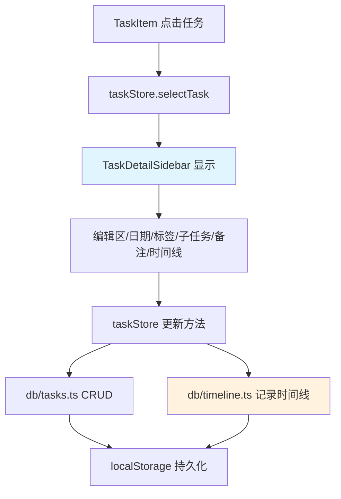
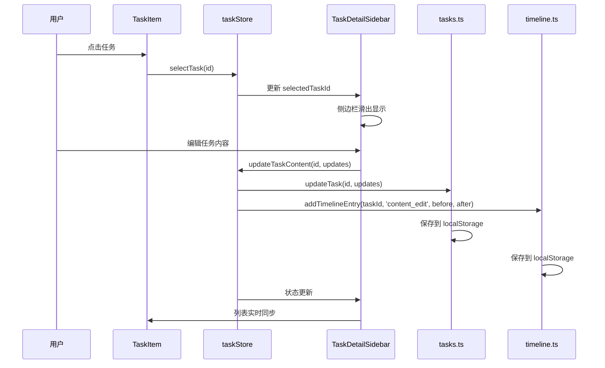

# F-007: 任务详情侧边栏 — 技术设计文档

## 1. 设计概要

**功能描述**：点击任务后从右侧滑出详情侧边栏，集成任务编辑、日期设置、标签管理、子任务、备注、时间线等功能，完全替代现有行内编辑方式。

**影响范围**：TaskItem 组件、taskStore、数据库层（新增时间线表）、Todo 类型定义（新增备注字段）

**技术难点**：
- 侧边栏状态与任务列表实时同步
- 时间线自动记录所有关键操作（需要改造现有 taskStore）
- 完全替代现有编辑方式后的交互流程重构

**外部依赖**：无

---

## 2. 架构概览

功能采用前端组件 + 状态管理 + 数据层三层架构：



**核心交互流程**：



---

## 3. 数据库设计

### 新增表

#### `task_timeline_entries`

**用途**：存储任务的所有关键操作历史记录，支持侧边栏时间线展示

| 字段名 | 类型 | 约束 | 说明 |
|--------|------|------|------|
| id | string | PK, UUID | 主键 |
| taskId | string | NOT NULL, 无外键约束 | 关联任务 ID |
| actionType | string | NOT NULL, enum | 操作类型 |
| beforeValue | string | NULL | 操作前的值（JSON 字符串） |
| afterValue | string | NULL | 操作后的值（JSON 字符串） |
| createdAt | string | NOT NULL | 操作时间 ISO 8601 |

**操作类型枚举 (actionType)**：
- `created` — 任务创建
- `content_edit` — 内容编辑
- `completed` — 标记完成
- `uncompleted` — 取消完成
- `due_date_changed` — 截止日期变更
- `reminder_changed` — 提醒时间变更
- `tags_changed` — 标签变更
- `deleted` — 任务删除
- `notes_changed` — 备注变更
- `subtask_changed` — 子任务变更

**索引设计**：
- `taskId`：查询特定任务的时间线 → AC-011
- `createdAt`：时间线按时间倒序排序 → AC-025

**存储方案**：使用 localStorage 存储，key 为 `todo-app-timeline-v1`

```typescript
// 数据结构示例
const timelineEntries: TimelineEntry[] = [
  {
    id: 'uuid-1',
    taskId: 'task-uuid-1',
    actionType: 'content_edit',
    beforeValue: '{"content":"旧内容"}',
    afterValue: '{"content":"新内容"}',
    createdAt: '2026-05-01T10:30:00.000Z'
  }
]
```

### 修改现有表

#### `Todo` 类型定义

**变更内容**：新增 `notes` 字段，支持任务备注功能

```typescript
// types.ts 中 Todo 接口新增字段
export interface Todo {
  // ... 现有字段 ...
  notes: string | null  // 任务备注，支持多行文本
}
```

**数据迁移**：无需迁移脚本。新任务创建时 `notes` 默认为 `null`，现有任务在读取时自动添加默认值。

---

## 4. 数据访问层设计

### 新增文件：`db/timeline.ts`

**用途**：封装时间线数据的 CRUD 操作

#### API 定义

```typescript
// 新增时间线记录 → AC-012, AC-023
export async function addTimelineEntry(
  taskId: string,
  actionType: TimelineActionType,
  beforeValue?: Record<string, any>,
  afterValue?: Record<string, any>
): Promise<TimelineEntry>

// 查询任务的时间线 → AC-011, AC-025
export async function getTimelineByTaskId(taskId: string): Promise<TimelineEntry[]>

// 删除任务时清除时间线 → AC-016
export async function deleteTimelineByTaskId(taskId: string): Promise<void>
```

#### 实现方案

```typescript
const TIMELINE_STORE_KEY = 'todo-app-timeline-v1'

function getEntries(): TimelineEntry[] {
  const data = localStorage.getItem(TIMELINE_STORE_KEY)
  return data ? JSON.parse(data) : []
}

function saveEntries(entries: TimelineEntry[]): void {
  localStorage.setItem(TIMELINE_STORE_KEY, JSON.stringify(entries))
}

export async function addTimelineEntry(
  taskId: string,
  actionType: TimelineActionType,
  beforeValue?: Record<string, any>,
  afterValue?: Record<string, any>
): Promise<TimelineEntry> {
  const entries = getEntries()
  const entry: TimelineEntry = {
    id: generateId(),
    taskId,
    actionType,
    beforeValue: beforeValue ? JSON.stringify(beforeValue) : null,
    afterValue: afterValue ? JSON.stringify(afterValue) : null,
    createdAt: new Date().toISOString(),
  }
  entries.push(entry)
  saveEntries(entries)
  return entry
}

export async function getTimelineByTaskId(taskId: string): Promise<TimelineEntry[]> {
  const entries = getEntries()
  return entries
    .filter(e => e.taskId === taskId)
    .sort((a, b) => new Date(b.createdAt).getTime() - new Date(a.createdAt).getTime())
}
```

---

## 5. 核心逻辑

### 5.1 侧边栏状态管理 → AC-001, AC-003, AC-017, AC-018

**触发条件**：用户点击任务

**处理流程**：
1. TaskItem 接收点击事件
2. 调用 `taskStore.selectTask(id)`
3. 如果侧边栏已打开且点击的是同一任务 → 不触发重新加载（AC-017）
4. 如果侧边栏已打开但点击的是不同任务 → 切换侧边栏内容（AC-018）
5. taskStore 更新 `selectedTaskId`
6. TaskDetailSidebar 监听 `selectedTaskId` 变化并渲染
7. TaskItem 根据 `selectedTaskId` 显示高亮状态（AC-003）

**taskStore 新增字段和方法**：

```typescript
interface TaskState {
  // ... 现有字段 ...
  selectedTaskId: string | null  // 当前选中的任务 ID
  
  // 新增方法
  selectTask: (id: string) => void
  deselectTask: () => void
}
```

### 5.2 时间线自动记录 → AC-012, AC-023, AC-024

**触发条件**：任务发生关键操作

**处理流程**：
1. taskStore 中的每个修改方法在保存数据后，调用 `addTimelineEntry`
2. 根据操作类型记录 `beforeValue` 和 `afterValue`
3. 时间线数据与任务数据同时保存到 localStorage

**关键改造点**：

```typescript
// taskStore.ts 中的改造示例
updateTaskContent: async (id: string, updates: Partial<Todo>) => {
  const tasks = getTasks()
  const task = tasks.find(t => t.id === id)
  if (!task) return
  
  const beforeValue = { content: task.content }
  const afterValue = { content: updates.content }
  
  // 更新任务
  const updated = await updateTask(id, updates)
  
  // 记录时间线
  await addTimelineEntry(id, 'content_edit', beforeValue, afterValue)
  
  // 更新状态
  set({ tasks: tasks.map(t => t.id === id ? updated : t) })
}
```

### 5.3 编辑内容自动保存 → AC-005

**触发条件**：编辑框失焦

**处理流程**：
1. 用户编辑任务内容
2. 编辑框触发 `onBlur` 事件
3. 比较当前值与原始值
4. 如果有变化，调用 `updateTaskContent`
5. 自动保存到数据库并记录时间线

### 5.4 任务删除时清理时间线 → AC-016

**触发条件**：用户删除任务

**处理流程**：
1. 调用 `deleteTask(id)`
2. 记录时间线 `actionType: 'deleted'`
3. 从任务列表中移除
4. 调用 `deleteTimelineByTaskId(id)` 清理时间线
5. 关闭侧边栏

---

## 6. 现有代码改动

| 模块 / 文件 | 改动内容 | 原因 | 对应 AC |
|-------------|---------|------|---------|
| `db/types.ts` | Todo 接口新增 `notes: string \| null` 字段 | 支持任务备注功能 | AC-002 |
| `db/tasks.ts` | `createTask` 创建时默认 `notes: null` | 新任务支持备注 | AC-002 |
| `db/timeline.ts` | **新增文件**：时间线 CRUD 操作 | 时间线数据持久化 | AC-012, AC-023 |
| `store/taskStore.ts` | 新增 `selectedTaskId`、`selectTask`、`deselectTask` | 侧边栏状态管理 | AC-001, AC-003 |
| `store/taskStore.ts` | 改造 `updateTaskContent`、`toggleTask`、`deleteTask` 等方法，添加时间线记录 | 自动记录关键操作 | AC-012, AC-024 |
| `components/TaskItem.tsx` | 修改点击逻辑：点击任务调用 `selectTask` 而非进入行内编辑 | 替代现有编辑方式 | AC-001 |
| `components/TaskItem.tsx` | 新增高亮样式：根据 `selectedTaskId` 显示选中状态 | 侧边栏任务高亮同步 | AC-003 |
| `components/TaskItem.tsx` | 移除或简化行内编辑弹窗逻辑 | 完全替代现有编辑方式 | AC-001 |
| `components/TaskDetailSidebar.tsx` | **新增文件**：侧边栏主组件 | 侧边栏 UI 实现 | AC-001 ~ AC-016 |
| `components/TaskDetailSidebar.tsx` | 集成编辑区、日期、标签、子任务、备注、时间线模块 | 完整功能展示 | AC-002 |
| `components/TaskTimeline.tsx` | **新增文件**：时间线展示组件 | 时间线只读展示 | AC-011, AC-025 |
| `components/SubtaskList.tsx` | 适配侧边栏样式（可选） | 子任务侧边栏集成 | AC-002 |
| `App.tsx` | 集成 TaskDetailSidebar 到主布局 | 侧边栏渲染位置 | AC-001 |

---

## 7. 技术决策

### 7.1 侧边栏状态管理方案

**背景**：需要在 taskStore 中管理侧边栏的打开/关闭和当前选中的任务

**选项**：
- A: 在 taskStore 中新增 `selectedTaskId` 字段 — 轻量，与现有状态管理一致
- B: 新增独立的 `sidebarStore` — 职责分离但增加复杂度
- C: 使用 React Context — 原生方案但与现有 Zustand 模式不一致

**结论**：选 A，在 taskStore 中管理侧边栏状态，保持简单且与现有模式一致。

### 7.2 时间线存储方案

**背景**：时间线数据需要独立存储且与任务关联

**选项**：
- A: 使用 localStorage 独立 key（`todo-app-timeline-v1`）— 简单，与现有 tasks 存储一致
- B: 将时间线嵌入任务对象内部 — 数据耦合度高，查询效率低
- C: 使用 IndexedDB — 功能强大但项目现有数据层使用 localStorage

**结论**：选 A，使用 localStorage 独立存储，与现有 `tasks`、`lists`、`tags` 存储模式一致。

### 7.3 编辑方式替代策略

**背景**：需要将现有的行内编辑/弹窗编辑完全替换为侧边栏编辑

**选项**：
- A: 修改 TaskItem 点击逻辑，移除行内编辑，统一使用侧边栏 — 彻底替代，体验一致
- B: 保留行内编辑，侧边栏作为补充 — 两种编辑方式并存，增加复杂度
- C: 侧边栏仅用于查看详情，编辑仍用弹窗 — 不符合需求

**结论**：选 A，完全替代现有编辑方式，点击任务直接打开侧边栏进行编辑。

---

## 8. 安全与性能

**输入校验**：
- 任务内容：侧边栏编辑框限制 200 字符，与现有 TaskInput 一致 → AC-021, AC-026
- 备注内容：不限制长度，但前端限制输入框最大高度
- 空内容校验：保存时检查内容非空，显示错误提示 → AC-020

**性能考量**：
- 时间线数据量控制：单任务时间线记录不超过 100 条，超过时自动清理最早记录
- 侧边栏懒加载：仅在侧边栏打开时加载时间线数据
- 编辑自动保存防抖：500ms 防抖，避免频繁写入

---

## 9. AC 覆盖总表

| AC 编号 | 验收标准概述 | 实现位置 |
|---------|-------------|---------|
| AC-001 | 点击任务展开侧边栏 | TaskItem onClick → taskStore.selectTask → TaskDetailSidebar |
| AC-002 | 侧边栏显示任务基本信息 | TaskDetailSidebar 组件布局 |
| AC-003 | 侧边栏任务高亮同步 | TaskItem 根据 selectedTaskId 显示高亮样式 |
| AC-004 | 编辑任务内容并保存 | TaskDetailSidebar 编辑区 + taskStore.updateTaskContent |
| AC-005 | 编辑任务内容自动保存 | 编辑框 onBlur 事件触发保存 |
| AC-006 | 取消编辑任务 | 侧边栏"取消"按钮恢复原始内容 |
| AC-007 | 设置任务截止日期 | DueDatePicker 集成到侧边栏 |
| AC-008 | 设置任务提醒时间 | ReminderPicker 集成到侧边栏 |
| AC-009 | 添加任务标签 | TagPicker 集成到侧边栏 + 时间线记录 |
| AC-010 | 删除任务标签 | TagPicker 移除标签 + 时间线记录 |
| AC-011 | 查看任务时间线 | TaskTimeline 组件展示 |
| AC-012 | 时间线记录关键操作 | taskStore 各方法调用 addTimelineEntry |
| AC-013 | 点击外部区域关闭侧边栏 | App.tsx 点击外部区域调用 deselectTask |
| AC-014 | 按ESC键关闭侧边栏 | TaskDetailSidebar onKeyDown ESC |
| AC-015 | 点击关闭按钮关闭侧边栏 | 侧边栏顶部 X 按钮调用 deselectTask |
| AC-016 | 删除任务 | 侧边栏删除按钮 + taskStore.deleteTask + 时间线记录 |
| AC-017 | 重复点击同一任务 | taskStore.selectTask 判断 id 是否相同 |
| AC-018 | 点击其他任务切换 | taskStore.selectTask 更新 selectedTaskId |
| AC-019 | 任务已被删除时打开侧边栏 | taskStore 检查任务是否存在 + Toast 提示 |
| AC-020 | 编辑空内容 | 编辑框校验 + Toast 错误提示 |
| AC-021 | 编辑内容超过字符限制 | 编辑框 maxLength={200} + 字数计数器 |
| AC-022 | 侧边栏打开时应用刷新 | 侧边栏状态不持久化，刷新后默认关闭 |
| AC-023 | 时间线数据持久化 | db/timeline.ts 使用 localStorage 存储 |
| AC-024 | 时间线记录完整性 | addTimelineEntry 记录 beforeValue/afterValue |
| AC-025 | 时间线排序规则 | getTimelineByTaskId 按 createdAt 倒序排序 |
| AC-026 | 任务内容字符限制 | 编辑框 maxLength={200} |

---

## 附录：变更记录

| 日期 | 变更内容 | 原因 |
|------|---------|------|
| 2026-05-01 | 初始版本 | F-007 任务详情侧边栏功能技术设计 |
