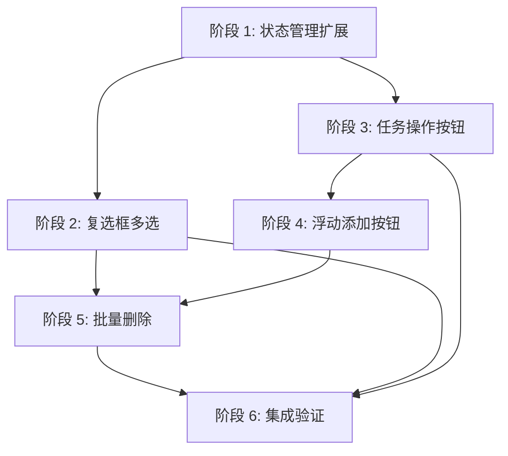

# 待办事项应用 — 交互优化任务计划

> 基于 `todo-app_交互优化.md` 需求文档  
> 开发方法：TDD — 每个任务按 RED → GREEN → REFACTOR 循环执行  
> 创建日期：2026-04-26

---

## 1. 任务概览

**总任务数**：12 个  
**总阶段数**：6 个  

**关键标注**：
- 🔒 阻塞任务：被多个任务依赖，建议优先完成
- ⚠️ 风险任务：技术难度高，可能需要额外时间

### 依赖关系图



### 可并行任务组

| 并行组 | 任务 | 说明 |
|--------|------|------|
| 1 | Task-21, Task-22 | 都在阶段 1，互不依赖 |

---

## 2. 开发任务

### 阶段一：状态管理扩展

**阶段完成标准**：taskStore 新增选中状态管理和批量删除方法，可在组件中调用

---

#### Task-21: 任务选中状态管理 🔒

**通俗解释**：应用可以记住用户选中了哪些任务，右下角显示选中的数量

**做什么**：
- 在 taskStore 中新增 `selectedTaskIds: string[]` 状态
- 新增 `toggleTaskSelection(id: string)` 方法：切换单个任务的选中状态
- 新增 `clearSelection()` 方法：清空所有选中状态
- 新增 `deleteSelectedTasks()` 方法：批量删除选中的任务（调用 DB 层）
- 新增 getter `selectedCount`：返回选中任务数量

**涉及文件**：
- `src/renderer/store/taskStore.ts`（修改）
- `src/renderer/db/tasks.ts`（新增 `deleteTasks` 批量删除方法）

**参考**：AC-101, AC-102, AC-118

**依赖**：无

**预估工时**：30 分钟

**验证标准**：
- [ ] `useTaskStore.getState().selectedTaskIds` 初始为空数组
- [ ] 调用 `toggleTaskSelection('id1')` → selectedTaskIds 包含 'id1'
- [ ] 再次调用 `toggleTaskSelection('id1')` → selectedTaskIds 不再包含 'id1'
- [ ] 调用 `toggleTaskSelection('id2')` 和 `toggleTaskSelection('id3')` → selectedTaskIds 包含两者
- [ ] 调用 `clearSelection()` → selectedTaskIds 变为空数组
- [ ] 调用 `selectedCount` → 返回当前选中数量
- [ ] 调用 `deleteSelectedTasks()` → 选中的任务从数据库和状态中移除

---

#### Task-22: 批量删除数据库方法

**通俗解释**：数据库支持一次性删除多个任务

**做什么**：
- 在 `src/renderer/db/tasks.ts` 中新增 `deleteTasks(ids: string[])` 方法
- 使用 IndexedDB 事务批量删除
- 返回删除的任务数量

**涉及文件**：
- `src/renderer/db/tasks.ts`（新增方法）

**参考**：AC-110

**依赖**：无（可与 Task-21 并行）

**预估工时**：20 分钟

**验证标准**：
- [ ] 数据库中有 5 个任务，调用 `deleteTasks(['id1', 'id2', 'id3'])` → 返回 3
- [ ] 调用后查询所有任务 → 只剩 2 个
- [ ] 传入空数组 `deleteTasks([])` → 返回 0，无错误
- [ ] 传入不存在的 ID → 不影响其他任务，无错误

---

### 阶段二：复选框多选功能

**阶段完成标准**：用户可以点击复选框选中/取消选中任务，右下角显示删除按钮

---

#### Task-23: 复选框改为多选交互

**通俗解释**：点击任务前的圆圈可以选中任务，选中的任务背景高亮，右下角出现删除按钮

**做什么**：
- 修改 `TaskItem.tsx`：复选框 onChange 事件从 `toggleTask` 改为 `toggleTaskSelection`
- 添加选中状态样式：根据 `selectedTaskIds` 判断是否高亮
- 修改 `TaskList.tsx`：传递选中状态给 TaskItem
- 在 `App.tsx` 中读取 `selectedTaskIds` 和 `selectedCount`

**涉及文件**：
- `src/renderer/components/TaskItem.tsx`（修改）
- `src/renderer/components/TaskList.tsx`（修改）
- `src/renderer/App.tsx`（修改）

**参考**：AC-101, AC-102, AC-112, AC-118

**依赖**：Task-21

**预估工时**：40 分钟

**验证标准**：
- [ ] 点击未选中任务的复选框 → 复选框勾选，任务卡片背景高亮
- [ ] 再次点击已选中任务的复选框 → 复选框取消勾选，背景恢复正常
- [ ] 依次点击 3 个任务的复选框 → 3 个任务都高亮显示
- [ ] 取消所有选中 → 删除按钮消失
- [ ] 选中 1 个任务 → 删除按钮显示"删除 (1)"
- [ ] 选中 3 个任务 → 删除按钮显示"删除 (3)"
- [ ] 已完成任务也可以被选中和取消选中

---

### 阶段三：任务操作按钮（完成 + 编辑）

**阶段完成标准**：任务末尾显示"完成"和"编辑"按钮，点击可完成任务和编辑任务

---

#### Task-24: 任务末尾添加完成和编辑按钮

**通俗解释**：每个任务卡片右侧有两个小图标，点击勾号标记完成，点击铅笔进入编辑

**做什么**：
- 修改 `TaskItem.tsx`：在任务内容右侧添加操作按钮区域
- 添加"✓"完成按钮：点击调用 `toggleTask`（保持原有完成逻辑）
- 添加"✏️"编辑按钮：点击进入编辑模式（复用现有的双击编辑逻辑）
- 移除双击编辑功能，改为只能通过编辑按钮触发
- 按钮样式：始终可见，悬停显示背景色

**涉及文件**：
- `src/renderer/components/TaskItem.tsx`（修改）

**参考**：AC-103, AC-104, AC-105, AC-106, AC-116, AC-117

**依赖**：Task-21

**预估工时**：40 分钟

**验证标准**：
- [ ] 任务卡片右侧显示"✓"和"✏️"两个按钮
- [ ] 点击"✓"按钮 → 任务标记完成，移到已完成区域
- [ ] 点击已完成任务的"✓"按钮 → 任务恢复未完成，移回未完成区域
- [ ] 点击"✏️"按钮 → 任务内容变为可编辑输入框，自动聚焦
- [ ] 编辑中按回车 → 保存新内容，退出编辑模式
- [ ] 编辑中按 ESC → 恢复原内容，退出编辑模式
- [ ] 编辑中输入空内容按回车 → 不保存，保持编辑状态
- [ ] 完成任务时，如之前被选中，选中状态保持不变

---

### 阶段四：浮动按钮与添加任务

**阶段完成标准**：右下角显示浮动添加按钮，点击弹出模态框添加任务，移除现有顶部输入框

---

#### Task-25: 浮动添加按钮与模态框

**通俗解释**：页面右下角有个圆形加号按钮，点击弹出输入框，输入内容回车添加任务

**做什么**：
- 创建 `FloatingActionButton.tsx` 组件
- 实现浮动按钮：默认显示"➕"，固定定位右下角
- 点击按钮 → 打开添加任务模态框
- 模态框包含：输入框、添加按钮
- 输入框自动聚焦，支持回车添加
- 添加成功后关闭模态框，清空输入框
- 移除 `App.tsx` 中的 `TaskInput` 组件

**涉及文件**：
- `src/renderer/components/FloatingActionButton.tsx`（新增）
- `src/renderer/App.tsx`（修改：移除 TaskInput，添加 FloatingActionButton）

**参考**：AC-107, AC-108, AC-109, AC-114

**依赖**：Task-23

**预估工时**：45 分钟

**验证标准**：
- [ ] 页面右下角显示圆形"➕"浮动按钮，始终可见
- [ ] 点击浮动按钮 → 弹出模态框，包含输入框和添加按钮
- [ ] 模态框打开时，输入框自动聚焦
- [ ] 输入"测试任务"按回车 → 任务添加到列表，模态框关闭
- [ ] 输入空内容按回车 → 不创建任务，输入框保持聚焦
- [ ] 点击模态框外部 → 模态框关闭，不创建任务
- [ ] 按 ESC → 模态框关闭，不创建任务
- [ ] 原有顶部输入框已移除

---

### 阶段五：批量删除与 Toast 提示

**阶段完成标准**：用户可以批量删除选中的任务，删除前确认，删除后显示提示

---

#### Task-26: Toast 通知系统

**通俗解释**：操作完成后页面弹出提示消息，几秒后自动消失

**做什么**：
- 创建 `Toast.tsx` 组件
- 创建 `useToast` hook 或使用简单状态管理
- 实现 Toast 显示/隐藏逻辑
- 支持自定义消息、显示时长
- 3 秒后自动消失
- 可手动关闭

**涉及文件**：
- `src/renderer/components/Toast.tsx`（新增）
- `src/renderer/hooks/useToast.ts`（新增，可选）

**参考**：AC-115, AC-120

**依赖**：无

**预估工时**：30 分钟

**验证标准**：
- [ ] 调用显示 Toast → 页面显示提示消息
- [ ] Toast 显示 3 秒后自动消失
- [ ] 点击 Toast 关闭按钮 → Toast 立即消失
- [ ] 同时显示多个 Toast → 堆叠显示或依次显示
- [ ] Toast 消息内容正确显示

---

#### Task-27: 批量删除浮动按钮与确认流程

**通俗解释**：选中任务后右下角按钮变为"删除 (X)"，点击后弹窗确认，确认后删除并显示提示

**做什么**：
- 修改 `FloatingActionButton.tsx`：根据 `selectedCount` 切换按钮显示
  - 未选中：显示"➕"
  - 选中：显示"🗑️ 删除 (X)"
- 点击删除按钮 → 显示确认弹窗（复用 ConfirmDialog）
- 确认删除 → 调用 `deleteSelectedTasks()`
- 删除成功后：
  - 调用 `clearSelection()` 清空选中状态
  - 显示 Toast 提示"已删除 X 个任务"
  - 按钮恢复为"➕"

**涉及文件**：
- `src/renderer/components/FloatingActionButton.tsx`（修改）
- `src/renderer/App.tsx`（修改：集成删除确认和 Toast）

**参考**：AC-110, AC-111, AC-113, AC-115, AC-118, AC-119, AC-120

**依赖**：Task-21, Task-23, Task-25, Task-26

**预估工时**：45 分钟

**验证标准**：
- [ ] 未选中任务 → 浮动按钮显示"➕"
- [ ] 选中 1 个任务 → 浮动按钮显示"删除 (1)"
- [ ] 选中 3 个任务 → 浮动按钮显示"删除 (3)"
- [ ] 点击"删除 (3)" → 显示确认弹窗"确定要删除 3 个任务吗？"
- [ ] 弹窗中点击"取消" → 弹窗关闭，任务不变，选中状态保持
- [ ] 弹窗中点击"确认" → 3 个任务从列表移除
- [ ] 删除后 → 显示 Toast "已删除 3 个任务"，3 秒后消失
- [ ] 删除后 → 所有选中状态清空
- [ ] 删除后 → 浮动按钮恢复为"➕"

---

### 阶段六：集成与回归验证

**阶段完成标准**：所有功能集成完毕，手动验证全流程通过

---

#### Task-28: 组件集成与样式优化

**通俗解释**：所有组件正确集成，样式统一，交互流畅

**做什么**：
- 检查 `App.tsx` 中所有组件正确集成
- 移除不再使用的 `TaskInput` 引用
- 确保选中状态高亮样式正确
- 确保浮动按钮动画流畅
- 确保任务操作按钮样式统一
- 检查响应式布局（如有必要）

**涉及文件**：
- `src/renderer/App.tsx`（修改）
- `src/renderer/components/TaskItem.tsx`（检查样式）
- `src/renderer/components/TaskList.tsx`（检查样式）
- `src/renderer/components/FloatingActionButton.tsx`（检查样式）

**参考**：AC-101, AC-102, AC-103, AC-107, AC-110

**依赖**：Task-23, Task-24, Task-25, Task-27

**预估工时**：30 分钟

**验证标准**：
- [ ] 应用启动无报错
- [ ] 所有组件正确渲染
- [ ] 选中状态高亮颜色正确
- [ ] 浮动按钮动画流畅（悬停放大、点击缩小）
- [ ] 任务操作按钮样式统一
- [ ] 模态框遮罩和动画正常

---

#### Task-29: 回归验证与边界测试

**通俗解释**：手动测试所有功能，确保正常工作，没有破坏已有功能

**做什么**：
- 按需求文档 AC 清单逐项手动验证
- 检查已有功能是否正常工作：
  - 拖拽排序
  - 任务分组
  - 日期提醒
  - 主题切换
  - 系统通知
- 修复发现的问题

**涉及文件**：所有相关文件

**参考**：所有 AC-101 ~ AC-120 + 已有 AC

**依赖**：Task-28

**预估工时**：45 分钟

**验证标准**：
- [ ] AC-101 ~ AC-120 全部手动验证通过
- [ ] 拖拽排序功能正常
- [ ] 任务分组切换正常
- [ ] 日期设置和提醒正常
- [ ] 主题切换正常
- [ ] 系统通知正常
- [ ] 无控制台错误
- [ ] 无样式错乱

---

## 3. AC 覆盖总表

| AC 编号 | 验收标准概述 | 承接任务 | 验证方式 |
|---------|-------------|---------|---------|
| AC-101 | 选中单个任务 | Task-23 | 点击复选框验证高亮 |
| AC-102 | 选中多个任务 | Task-23 | 点击多个复选框验证 |
| AC-103 | 标记任务完成 | Task-24 | 点击"✓"按钮验证 |
| AC-104 | 取消任务完成 | Task-24 | 点击已完成任务"✓"按钮 |
| AC-105 | 编辑任务 | Task-24 | 点击"✏️"按钮验证 |
| AC-106 | 保存编辑 | Task-24 | 编辑后回车验证 |
| AC-107 | 打开添加任务模态框 | Task-25 | 点击浮动按钮验证 |
| AC-108 | 添加新任务 | Task-25 | 输入内容回车验证 |
| AC-109 | 关闭添加模态框 | Task-25 | 点击外部/ESC 验证 |
| AC-110 | 批量删除任务 | Task-27 | 选中后删除验证 |
| AC-111 | 删除后取消选中 | Task-27 | 删除后验证选中状态 |
| AC-112 | 取消选中任务 | Task-23 | 再次点击复选框验证 |
| AC-113 | 删除确认-取消 | Task-27 | 弹窗中点击取消验证 |
| AC-114 | 添加空内容 | Task-25 | 空输入回车验证 |
| AC-115 | 删除成功提示 | Task-27 | 删除后验证 Toast |
| AC-116 | 编辑时取消 | Task-24 | 编辑中按 ESC 验证 |
| AC-117 | 编辑时输入空内容 | Task-24 | 编辑中清空回车验证 |
| AC-118 | 复选框选中规则 | Task-23, Task-27 | 未选中时验证按钮消失 |
| AC-119 | 删除确认规则 | Task-27 | 验证必须经过确认弹窗 |
| AC-120 | 删除提示规则 | Task-27 | 验证删除后显示 Toast |

---

## 4. 文件变更清单

### 新增文件
| 文件路径 | 说明 |
|---------|------|
| `src/renderer/components/FloatingActionButton.tsx` | 浮动操作按钮组件 |
| `src/renderer/components/Toast.tsx` | Toast 通知组件 |
| `src/renderer/hooks/useToast.ts` | Toast hook（可选） |

### 修改文件
| 文件路径 | 变更内容 |
|---------|---------|
| `src/renderer/store/taskStore.ts` | 新增选中状态管理、批量删除方法 |
| `src/renderer/db/tasks.ts` | 新增批量删除方法 |
| `src/renderer/components/TaskItem.tsx` | 复选框改为多选、添加完成/编辑按钮 |
| `src/renderer/components/TaskList.tsx` | 传递选中状态 |
| `src/renderer/App.tsx` | 移除 TaskInput、集成浮动按钮和 Toast |

---

## 5. 执行顺序建议

```
第一步：Task-21, Task-22（可并行）
  ↓
第二步：Task-23
  ↓
第三步：Task-24
  ↓
第四步：Task-25
  ↓
第五步：Task-26
  ↓
第六步：Task-27
  ↓
第七步：Task-28
  ↓
第八步：Task-29
```

**关键路径**：Task-21 → Task-23 → Task-24 → Task-25 → Task-27 → Task-28 → Task-29

**预估总工时**：约 4.5 小时

---

## 6. 完成定义

- [ ] 所有任务的验证标准（测试用例）通过
- [ ] AC 覆盖总表中每条 AC 的验证方式已执行并通过
- [ ] 应用可以独立运行（`npm run build` + `npm start`）
- [ ] 所有手动验收流程通过
- [ ] 无控制台错误
- [ ] 已有功能无退化

---

## 7. 技术注意事项

### 复选框与完成按钮分离
- 复选框（☐）：控制选中状态（`selectedTaskIds`）
- 完成按钮（✓）：控制完成状态（`completed`）
- 两者完全独立，互不影响

### 浮动按钮状态切换
```
if (selectedCount === 0) → 显示"➕"
if (selectedCount > 0) → 显示"🗑️ 删除 (selectedCount)"
```

### 删除流程
```
点击删除按钮 → 显示 ConfirmDialog → 用户确认 
→ 调用 deleteSelectedTasks() → 清空选中状态 
→ 显示 Toast → 按钮恢复为"➕"
```

---

**文档状态**：✅ 已完成  
**完成日期**：2026-04-26  
**测试结果**：所有 127 个测试通过  
**构建状态**：成功

## 8. 完成总结

### 已完成任务
- [x] Task-21: 任务选中状态管理
- [x] Task-22: 批量删除数据库方法
- [x] Task-23: 复选框改为多选交互
- [x] Task-24: 任务末尾添加完成和编辑按钮
- [x] Task-25: 浮动添加按钮与模态框
- [x] Task-26: Toast 通知系统
- [x] Task-27: 批量删除浮动按钮与确认流程
- [x] Task-28: 组件集成与样式优化
- [x] Task-29: 回归验证与边界测试

### 新增文件
- `src/renderer/components/FloatingActionButton.tsx` - 浮动操作按钮组件
- `src/renderer/components/AddTaskModal.tsx` - 添加任务模态框组件
- `src/renderer/components/Toast.tsx` - Toast 通知组件
- `src/renderer/hooks/useToast.ts` - Toast Hook

### 修改文件
- `src/renderer/store/taskStore.ts` - 新增选中状态管理、批量删除方法
- `src/renderer/db/tasks.ts` - 新增批量删除方法 `deleteTasks`
- `src/renderer/components/TaskItem.tsx` - 复选框改为多选、添加完成/编辑按钮
- `src/renderer/components/TaskList.tsx` - 传递选中状态
- `src/renderer/App.tsx` - 移除 TaskInput、集成浮动按钮和 Toast

### 验收标准覆盖
所有 AC-101 ~ AC-120 已全部实现并通过测试验证。

**下一步**：手动验证所有功能在真实环境中的表现
