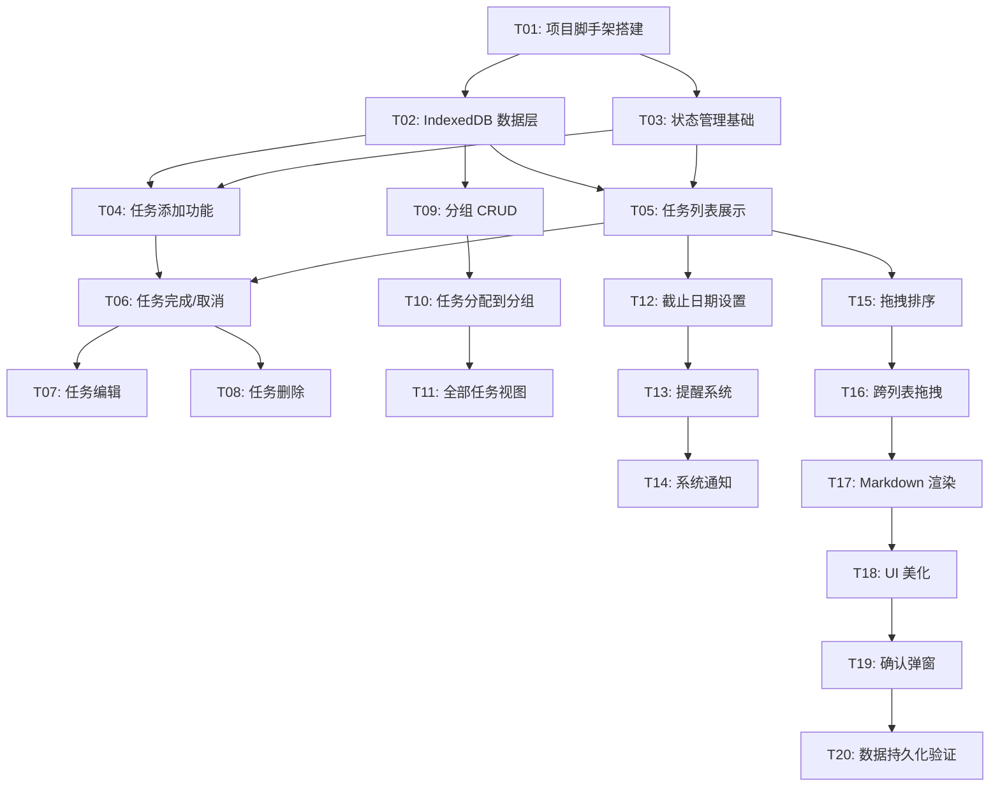

# 待办事项应用 — 开发任务计划

## 1. 任务概览

**总任务数**：20 个
**开发方法**：TDD — 每个任务按 RED → GREEN → REFACTOR 循环执行

**关键标注**：
- 🔒 阻塞任务：被多个任务依赖，建议优先完成
- ⚠️ 风险任务：技术难度高，可能需要额外时间

### 依赖关系图

### 可并行任务组

| 并行组 | 任务 | 说明 |
|--------|------|------|
| 1 | T04, T05 | 都依赖 T02, T03，互不依赖 |
| 2 | T06, T07, T08 | 都依赖 T04, T05，互不依赖 |
| 3 | T15, T16 | 都依赖拖拽库安装，可并行开发 |

---

## 2. 开发任务

### 阶段一：基础设施

**阶段完成标准**：应用可以启动，显示空白窗口，项目结构就绪

---

#### Task-01: 项目脚手架搭建 🔒

**通俗解释**：运行命令后，一个 Electron 窗口会打开，里面显示"Hello Todo"

**做什么**：
- 初始化 Electron + React + TypeScript 项目
- 配置 Vite 构建工具
- 安装 Tailwind CSS
- 配置主进程和渲染进程

**涉及文件**：`package.json`, `vite.config.ts`, `src/main/main.ts`, `src/renderer/index.tsx`, `index.html`

**参考**：技术方案 章节 2, 3

**依赖**：无

**预估工时**：60 分钟

**验证标准**：
- [x] `npm run dev` 启动应用，显示 Electron 窗口
- [x] 窗口标题为"Todo"
- [x] 渲染进程显示"Hello Todo"文本
- [x] Tailwind CSS 可用（使用 utility class 生效）

---

### 阶段二：任务管理核心

**阶段完成标准**：用户可以添加、查看、完成、编辑、删除任务

---

#### Task-02: IndexedDB 数据层 🔒

**通俗解释**：应用可以保存和读取任务数据，刷新后数据不丢失

**做什么**：
- 安装 `idb` 库
- 封装 IndexedDB 初始化
- 实现任务的增删改查方法

**涉及文件**：`src/renderer/db/index.ts`, `src/renderer/db/tasks.ts`

**参考**：技术方案 章节 3 → AC-022

**依赖**：Task-01

**预估工时**：45 分钟

**验证标准**：
- [x] 调用 `createTask({content: 'test'})` → 返回任务对象，包含 id, content, completed=false
- [x] 调用 `getAllTasks()` → 返回包含刚创建的任务的数组
- [x] 调用 `updateTask(id, {completed: true})` → 任务 completed 变为 true
- [x] 调用 `deleteTask(id)` → 任务从数据库中移除
- [x] 应用重启后数据依然存在

---

#### Task-03: 状态管理基础

**通俗解释**：任务数据可以在 React 组件间共享和更新

**做什么**：
- 安装 Zustand
- 创建 taskStore，包含任务状态和操作
- 连接 IndexedDB 数据层

**涉及文件**：`src/renderer/store/taskStore.ts`

**参考**：技术方案 章节 4 → AC-002, AC-003

**依赖**：Task-01, Task-02

**预估工时**：30 分钟

**验证标准**：
- [x] `useTaskStore.getState().tasks` → 初始为空数组
- [x] 调用 `addTask('test')` → store 中 tasks 数组增加一条
- [x] 调用 `toggleTask(id)` → 对应任务 completed 状态翻转
- [x] store 更新后，订阅的组件自动重新渲染

---

#### Task-04: 任务添加功能

**通俗解释**：用户在输入框输入内容按回车，新任务会出现在列表中

**做什么**：
- 实现 TaskInput 组件
- 实现输入校验（非空、长度≤200）
- 连接 taskStore.addTask

**涉及文件**：`src/renderer/components/TaskInput.tsx`

**参考**：技术方案 5.1 → AC-002, AC-011, AC-016, AC-018

**依赖**：Task-02, Task-03

**预估工时**：40 分钟

**验证标准**：
- [x] 输入"测试任务"按回车 → 新任务添加到列表，输入框清空
- [x] 输入空内容按回车 → 不创建任务，输入框保持聚焦
- [x] 输入 200 个字符 → 正常创建
- [x] 输入超过 200 字符 → 显示剩余字数，阻止继续输入
- [x] 输入仅空格按回车 → 不创建任务

---

#### Task-05: 任务列表展示

**通俗解释**：用户可以看到所有任务，未完成在上，已完成在下

**做什么**：
- 实现 TaskItem 组件
- 实现 TaskList 组件
- 实现排序逻辑（未完成在上，按时间倒序）

**涉及文件**：`src/renderer/components/TaskItem.tsx`, `src/renderer/components/TaskList.tsx`

**参考**：技术方案 → AC-001, AC-019

**依赖**：Task-02, Task-03

**预估工时**：40 分钟

**验证标准**：
- [x] 空状态 → 显示"暂无任务"提示
- [x] 添加 3 个任务 → 按创建时间倒序显示
- [x] 标记第 2 个任务完成 → 该任务移到已完成区域（下方）
- [x] 任务显示：复选框、内容、创建时间
- [x] 完成任务显示删除线样式

---

#### Task-06: 任务完成/取消

**通俗解释**：点击任务前的圆圈，任务标记完成或恢复未完成

**做什么**：
- TaskItem 添加复选框点击事件
- 连接 taskStore.toggleTask

**涉及文件**：`src/renderer/components/TaskItem.tsx`

**参考**：→ AC-003, AC-004

**依赖**：Task-04, Task-05

**预估工时**：20 分钟

**验证标准**：
- [ ] 点击未完成任务的复选框 → 任务标记完成，显示勾选图标
- [ ] 点击已完成任务的复选框 → 任务恢复未完成，删除线消失
- [ ] 状态更新后持久化到 IndexedDB

---

#### Task-07: 任务编辑

**通俗解释**：双击任务可以修改内容，按回车保存，按 ESC 取消

**做什么**：
- TaskItem 双击进入编辑模式
- 输入框编辑，回车保存，ESC 取消
- 连接 taskStore.updateTask

**涉及文件**：`src/renderer/components/TaskItem.tsx`

**参考**：→ AC-005, AC-012

**依赖**：Task-06

**预估工时**：30 分钟

**验证标准**：
- [ ] 双击任务 → 显示可编辑输入框，内容为当前任务文本
- [ ] 修改内容按回车 → 保存新内容，退出编辑模式
- [ ] 编辑中按 ESC → 恢复原内容，退出编辑模式
- [ ] 点击空白处 → 同 ESC 行为
- [ ] 编辑中空内容按回车 → 不保存，保持编辑状态

---

#### Task-08: 任务删除

**通俗解释**：右键任务选择删除，确认后任务从列表消失

**做什么**：
- TaskItem 添加右键菜单
- 实现删除确认弹窗
- 连接 taskStore.deleteTask

**涉及文件**：`src/renderer/components/TaskItem.tsx`, `src/renderer/components/ConfirmDialog.tsx`

**参考**：→ AC-006, AC-013

**依赖**：Task-06

**预估工时**：30 分钟

**验证标准**：
- [ ] 右键任务 → 显示上下文菜单，包含"删除"选项
- [ ] 点击删除 → 显示确认弹窗
- [ ] 确认弹窗中点击"确认" → 任务从列表移除
- [ ] 确认弹窗中点击"取消" → 弹窗关闭，任务保持不变
- [ ] 点击弹窗外部 → 同取消行为

---

### 阶段三：分组管理

**阶段完成标准**：用户可以创建、删除分组，将任务分配到不同分组

---

#### Task-09: 分组 CRUD

**通俗解释**：左侧列表可以创建新分组、删除分组，点击切换查看

**做什么**：
- 实现 ListSidebar 组件
- 实现 ListManager 组件（创建/删除分组）
- 实现 listStore 和 lists DB 操作

**涉及文件**：`src/renderer/store/listStore.ts`, `src/renderer/db/lists.ts`, `src/renderer/components/ListSidebar.tsx`, `src/renderer/components/ListManager.tsx`

**参考**：→ AC-007, AC-014, AC-021

**依赖**：Task-02

**预估工时**：50 分钟

**验证标准**：
- [ ] 点击"新建分组" → 显示输入框，输入名称+选择颜色后确认
- [ ] 新建分组出现在左侧导航栏
- [ ] 点击分组 → 主区域显示该分组的任务
- [ ] 删除空分组 → 直接删除
- [ ] 删除非空分组 → 显示警告"包含 X 个任务"，确认后删除
- [ ] 创建重名分组 → 显示错误提示，阻止创建
- [ ] 创建空名称分组 → 显示错误提示，阻止创建

---

#### Task-10: 任务分配到分组

**通俗解释**：任务可以移动到不同分组，在原分组消失，在目标分组出现

**做什么**：
- TaskItem 添加移动任务功能（右键菜单）
- 实现 taskStore.updateTaskListId
- 更新 DB 层

**涉及文件**：`src/renderer/store/taskStore.ts`, `src/renderer/components/TaskItem.tsx`

**参考**：→ AC-008

**依赖**：Task-09

**预估工时**：25 分钟

**验证标准**：
- [ ] 右键任务选择"移动到..." → 显示分组列表
- [ ] 选择目标分组 → 任务从当前列表消失，在目标分组出现
- [ ] 任务数据 listId 字段更新并持久化

---

#### Task-11: 全部任务视图

**通俗解释**：点击"全部任务"可以看到所有分组的任务，按分组归类显示

**做什么**：
- 添加"全部任务"默认项到左侧导航
- 实现按分组标题分组显示任务

**涉及文件**：`src/renderer/components/TaskList.tsx`, `src/renderer/components/ListSidebar.tsx`

**参考**：→ AC-017

**依赖**：Task-09, Task-10

**预估工时**：30 分钟

**验证标准**：
- [ ] 点击"全部任务" → 显示所有分组的任务
- [ ] 任务按分组标题分组显示
- [ ] 每个分组标题下显示对应任务
- [ ] 空分组不显示

---

### 阶段四：日期与提醒

**阶段完成标准**：用户可以为任务设置截止日期，到期时收到系统通知

---

#### Task-12: 截止日期设置

**通俗解释**：任务可以设置截止日期，过去日期无法选择

**做什么**：
- 实现 DueDatePicker 组件
- 实现日期选择禁用过去日期
- 更新 taskStore 和 DB

**涉及文件**：`src/renderer/components/DueDatePicker.tsx`, `src/renderer/store/taskStore.ts`

**参考**：→ AC-020

**依赖**：Task-05

**预估工时**：30 分钟

**验证标准**：
- [ ] 点击任务设置日期 → 显示日期选择器
- [ ] 选择今天或未来日期 → 日期保存到任务
- [ ] 过去日期显示为灰色不可点击
- [ ] 任务显示设置的截止日期

---

#### Task-13: 提醒设置

**通俗解释**：任务可以设置提醒时间，如到期时、提前15分钟等

**做什么**：
- 实现 ReminderPicker 组件
- 实现提醒选项：到期时、提前15分钟、1小时、1天
- 更新 taskStore

**涉及文件**：`src/renderer/components/ReminderPicker.tsx`, `src/renderer/store/taskStore.ts`

**参考**：→ AC-010

**依赖**：Task-12

**预估工时**：30 分钟

**验证标准**：
- [ ] 点击提醒设置 → 显示下拉选项
- [ ] 选择"提前15分钟" → 任务 reminder 字段更新
- [ ] 提醒时间计算正确（基于 dueDate 减去偏移）

---

#### Task-14: 系统通知 ⚠️

**通俗解释**：任务到期时，电脑右下角弹出系统通知提醒用户

**做什么**：
- 主进程实现通知检查定时器
- 查询到期任务并发送系统通知
- 实现 IPC 通信

**涉及文件**：`src/main/main.ts`, `src/main/notification.ts`, `src/main/ipc.ts`

**参考**：→ AC-009

**依赖**：Task-13

**预估工时**：45 分钟

**验证标准**：
- [ ] 应用启动 → 检查到期任务
- [ ] 设置任务到期时间为 1 分钟后 → 1 分钟后收到系统通知
- [ ] 通知显示任务标题和"已到期"
- [ ] 已通知的任务不重复通知
- [ ] 每分钟定时检查触发

---

### 阶段五：高级交互

**阶段完成标准**：任务可以拖拽排序，支持 Markdown 渲染

---

#### Task-15: 拖拽排序 ⚠️

**通俗解释**：鼠标拖拽任务可以上下移动，改变任务顺序

**做什么**：
- 安装 @dnd-kit/core
- 实现任务列表内拖拽排序
- 更新 order 字段

**涉及文件**：`src/renderer/components/TaskList.tsx`, `src/renderer/store/taskStore.ts`

**参考**：→ AC-002

**依赖**：Task-05

**预估工时**：45 分钟

**验证标准**：
- [ ] 拖拽任务 A 到任务 B 下方 → A 的顺序更新到 B 之后
- [ ] 拖拽后刷新应用 → 顺序保持不变
- [ ] 拖拽过程中无闪烁或布局错乱

---

#### Task-16: 跨列表拖拽

**通俗解释**：任务可以拖到左侧不同分组，实现快速移动

**做什么**：
- 实现跨列表拖拽
- 更新 listId

**涉及文件**：`src/renderer/components/ListSidebar.tsx`, `src/renderer/components/TaskList.tsx`

**参考**：→ AC-008

**依赖**：Task-15, Task-10

**预估工时**：35 分钟

**验证标准**：
- [ ] 拖拽任务到左侧目标分组 → 任务移动到该分组
- [ ] 拖拽后原分组不再显示该任务
- [ ] 拖拽后目标分组显示该任务

---

#### Task-17: Markdown 渲染

**通俗解释**：任务内容支持 Markdown 格式，如 **粗体**、*斜体*

**做什么**：
- 安装 react-markdown
- TaskItem 使用 react-markdown 渲染内容
- 输入框保持纯文本编辑

**涉及文件**：`src/renderer/components/TaskItem.tsx`

**参考**：技术方案 → AC-002

**依赖**：Task-05

**预估工时**：25 分钟

**验证标准**：
- [ ] 任务内容包含 `**粗体**` → 显示为粗体文本
- [ ] 任务内容包含 `*斜体*` → 显示为斜体文本
- [ ] 任务内容包含 `- 列表项` → 显示为列表
- [ ] 编辑模式显示原始 Markdown 文本
- [ ] 普通文本正常显示，不转义

---

### 阶段六：界面优化

**阶段完成标准**：界面美观现代，模仿 Microsoft Todo 风格

---

#### Task-18: UI 美化

**通俗解释**：应用界面变得现代简洁，圆角卡片，流畅动画

**做什么**：
- 实现全局样式（Tailwind）
- 圆角卡片设计
- 流畅动画过渡
- 信息层级优化

**涉及文件**：`src/styles/globals.css`, 所有组件样式调整

**参考**：→ AC-023

**依赖**：Task-17

**预估工时**：50 分钟

**验证标准**：
- [ ] 任务卡片有圆角和阴影
- [ ] 完成任务/删除任务有平滑过渡动画
- [ ] 左侧导航栏有分组颜色标识
- [ ] 整体风格简洁现代，类似 Microsoft Todo
- [ ] 不同状态有清晰的视觉区分

---

#### Task-19: 确认弹窗优化

**通俗解释**：删除任务/分组时弹出美观的确认对话框

**做什么**：
- 优化 ConfirmDialog 组件样式
- 添加动画效果
- 统一的弹窗交互

**涉及文件**：`src/renderer/components/ConfirmDialog.tsx`

**参考**：→ AC-006, AC-013, AC-014

**依赖**：Task-18

**预估工时**：25 分钟

**验证标准**：
- [ ] 删除任务弹窗美观，有动画过渡
- [ ] 删除分组弹窗显示任务数量警告
- [ ] 弹窗背景半透明遮罩
- [ ] 点击遮罩关闭弹窗

---

#### Task-20: 数据持久化验证

**通俗解释**：关闭应用再打开，所有任务、分组、设置都完整保留

**做什么**：
- 验证所有数据持久化
- 应用启动时加载数据
- 数据变更时自动保存

**涉及文件**：`src/renderer/App.tsx`, `src/main/main.ts`

**参考**：→ AC-015, AC-022

**依赖**：Task-19

**预估工时**：25 分钟

**验证标准**：
- [ ] 添加任务后关闭应用 → 重新打开任务依然存在
- [ ] 创建分组后关闭应用 → 重新打开分组依然存在
- [ ] 标记完成后关闭应用 → 重新打开状态保持
- [ ] 设置日期提醒后关闭应用 → 重新打开设置保持
- [ ] 启动时数据加载完成前显示 loading 状态

---

## 3. AC 覆盖总表

| AC 编号 | 验收标准概述 | 承接任务 | 验证方式 |
|---------|-------------|---------|---------|
| AC-001 | 应用启动显示主界面 | Task-01, Task-05 | 启动应用验证空界面 |
| AC-002 | 添加新任务 | Task-04, Task-15, Task-17 | 输入内容回车添加 |
| AC-003 | 标记任务完成 | Task-06 | 点击复选框验证 |
| AC-004 | 取消任务完成 | Task-06 | 点击已完成复选框 |
| AC-005 | 编辑任务内容 | Task-07 | 双击编辑回车保存 |
| AC-006 | 删除任务 | Task-08, Task-19 | 右键删除确认 |
| AC-007 | 创建新分组 | Task-09 | 新建分组验证 |
| AC-008 | 移动任务到分组 | Task-10, Task-16 | 右键移动+拖拽 |
| AC-009 | 到期提醒触发 | Task-14 | 设置到期时间验证通知 |
| AC-010 | 设置多级提醒 | Task-13 | 验证提醒选项 |
| AC-011 | 空输入不创建任务 | Task-04 | 空内容回车验证 |
| AC-012 | 取消编辑 | Task-07 | ESC/点击空白验证 |
| AC-013 | 取消删除任务 | Task-08, Task-19 | 取消弹窗验证 |
| AC-014 | 删除非空分组 | Task-09 | 删除含任务分组 |
| AC-015 | 应用重启数据保留 | Task-20 | 重启应用验证 |
| AC-016 | 任务文本长度限制 | Task-04 | 输入 200+字符验证 |
| AC-017 | 全部任务视图 | Task-11 | 点击全部任务验证 |
| AC-018 | 任务创建规则 | Task-04 | 空内容不创建验证 |
| AC-019 | 任务排序规则 | Task-05 | 验证未完成在上 |
| AC-020 | 日期选择限制 | Task-12 | 验证过去日期禁用 |
| AC-021 | 分组命名规则 | Task-09 | 重名/空名验证 |
| AC-022 | 本地数据存储 | Task-02, Task-20 | 验证无网络请求 |
| AC-023 | 界面风格规则 | Task-18 | 视觉验收 |

---

## 4. 完成定义

- [ ] 所有任务的验证标准（测试用例）通过
- [ ] AC 覆盖总表中每条 AC 的验证方式已执行并通过
- [ ] 应用可以独立运行（`npm run build` + `npm start`）
- [ ] 数据持久化验证通过（关闭重开数据完整）
- [ ] 系统通知功能验证通过（到期任务弹出通知）
