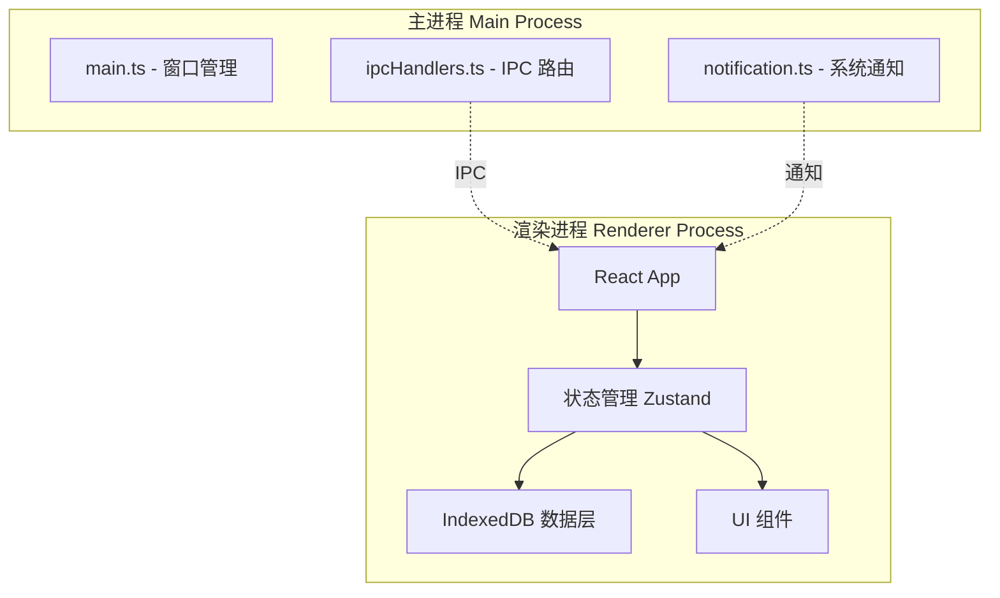
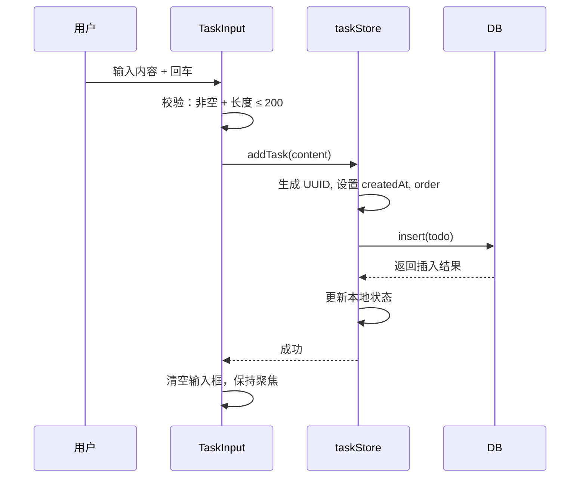
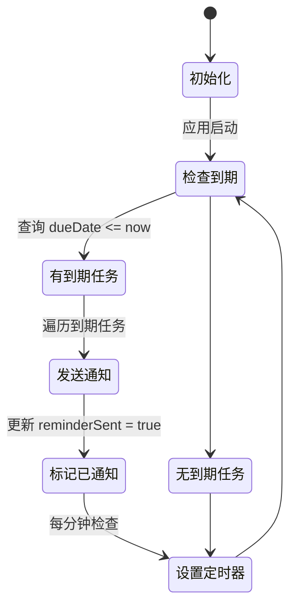

# 待办事项应用 — 技术设计文档

## 1. 设计概要

**功能描述**：基于 Electron + React + TypeScript 的桌面待办应用，支持任务管理、分组、日期提醒，数据本地存储

**影响范围**：全新项目，从零开始搭建

**技术难点**：
- Electron 主进程与渲染进程间的通信架构
- 桌面通知系统（系统级提醒）
- 拖拽排序与跨列表拖拽交互
- IndexedDB 数据持久化与状态管理集成

**外部依赖**：无

---

## 2. 架构概览

应用采用 Electron 标准架构：主进程管理窗口和系统通知，渲染进程负责 UI 和交互，通过 IPC 通信。



---

## 3. 数据模型设计

### IndexedDB 表结构

使用 `idb` 库封装 IndexedDB 操作。

#### `todos`

**用途**：存储所有待办任务

| 字段名 | 类型 | 约束 | 说明 |
|--------|------|------|------|
| id | string | PK, UUID | 主键 |
| content | string | NOT NULL, maxLength: 200 | 任务内容（支持 Markdown） |
| completed | boolean | DEFAULT false | 完成状态 |
| listId | string | FK → lists.id | 所属分组 ID |
| dueDate | string | NULL | 截止日期 ISO 8601 |
| reminder | string | NULL | 提醒时间配置 |
| order | number | NOT NULL | 拖拽排序权重 |
| createdAt | string | NOT NULL | 创建时间 ISO 8601 |
| updatedAt | string | NOT NULL | 更新时间 ISO 8601 |

**索引**：
- `listId`: 查询特定分组的任务 → AC-008, AC-017
- `completed`: 筛选已完成/未完成任务 → AC-019
- `dueDate`: 查询到期任务用于提醒 → AC-009

#### `lists`

**用途**：存储任务分组

| 字段名 | 类型 | 约束 | 说明 |
|--------|------|------|------|
| id | string | PK, UUID | 主键 |
| name | string | NOT NULL, UNIQUE | 分组名称 |
| color | string | NOT NULL | 主题色 HEX |
| icon | string | NOT NULL | 图标标识 |
| order | number | NOT NULL | 排序权重 |
| createdAt | string | NOT NULL | 创建时间 |

**索引**：
- `name`: 唯一约束，防止重名 → AC-021

---

## 4. 前端架构设计

### 目录结构

```
src/
├── main/                    # Electron 主进程
│   ├── main.ts              # 入口，窗口管理
│   ├── ipc.ts               # IPC 通信处理
│   └── notification.ts      # 系统通知
├── renderer/                # React 渲染进程
│   ├── components/          # UI 组件
│   │   ├── TaskItem.tsx     # 任务卡片
│   │   ├── TaskInput.tsx    # 添加任务输入框
│   │   ├── TaskList.tsx     # 任务列表容器
│   │   ├── ListSidebar.tsx  # 左侧分组导航
│   │   ├── ListManager.tsx  # 分组管理
│   │   ├── DueDatePicker.tsx # 日期选择器
│   │   ├── ReminderPicker.tsx # 提醒设置
│   │   ├── ThemeSwitcher.tsx # 主题切换组件（新增）
│   │   └── SettingsPanel.tsx # 设置面板（新增）
│   ├── config/              # 配置文件（新增）
│   │   └── themes.ts        # 主题色板配置
│   ├── hooks/               # 自定义 Hooks
│   │   ├── useTasks.ts      # 任务操作 hook
│   │   └── useLists.ts      # 分组操作 hook
│   ├── store/               # 状态管理
│   │   ├── taskStore.ts     # 任务状态
│   │   ├── listStore.ts     # 分组状态
│   │   └── themeStore.ts    # 主题状态（新增）
│   ├── db/                  # 数据访问层
│   │   ├── index.ts         # DB 初始化
│   │   ├── tasks.ts         # 任务 CRUD
│   │   └── lists.ts         # 分组 CRUD
│   ├── utils/               # 工具函数
│   │   ├── uuid.ts          # ID 生成
│   │   └── date.ts          # 日期处理
│   ├── App.tsx              # 根组件
│   └── index.tsx            # 入口
├── styles/
│   └── globals.css          # Tailwind + 全局样式
├── index.html
└── package.json
```

### 状态管理方案

使用 **Zustand** 作为状态管理：
- 轻量、TypeScript 友好
- 直接集成异步操作
- 避免 Redux 的样板代码

---

## 5. 核心逻辑

### 5.1 任务创建流程 → AC-002, AC-011, AC-018



### 5.2 提醒系统 → AC-009, AC-010



**实现方案**：
- 主进程使用 `setInterval` 每分钟检查到期任务
- 通过 `new Notification()` 发送系统通知
- 通知点击后聚焦到对应任务

### 5.3 拖拽排序 → AC-002, AC-008

使用 `@dnd-kit/core` 实现：
- 任务列表内拖拽：更新 `order` 字段
- 跨列表拖拽：更新 `listId` + 触发重新渲染

```typescript
// 拖拽排序核心逻辑
function handleDragEnd(event: DragEndEvent) {
  const { active, over } = event;
  if (!over) return;
  
  if (active.id !== over.id) {
    // 更新排序权重
    updateTaskOrder(active.id, over.id);
  }
}
```

---

## 6. 技术决策

### 6.1 状态管理选择

**选项**：
- A: Zustand — 轻量、简单、TypeScript 友好
- B: Redux Toolkit — 功能强大但样板代码多
- C: React Context + useReducer — 原生方案但性能较差

**结论**：选 Zustand，项目规模适中，不需要 Redux 的复杂度

### 6.2 拖拽库选择

**选项**：
- A: @dnd-kit/core — 现代、可访问性好、React 18 兼容
- B: react-beautiful-dnd — 成熟但维护停滞
- C: 原生 HTML5 DnD — 灵活但需要大量手写逻辑

**结论**：选 @dnd-kit/core，API 现代，维护活跃

### 6.3 Markdown 渲染

**选项**：
- A: react-markdown — 安全、轻量、可扩展
- B: marked + DOMPurify — 更灵活但需要自己处理安全
- C: 自定义解析 — 完全控制但工作量大

**结论**：选 react-markdown，安全且足够满足需求

### 6.4 主题系统方案

**选项**：
- A: CSS 变量 + Zustand Store — 轻量级方案，通过 JS 切换 CSS 变量实现主题
- B: CSS-in-JS（styled-components）— 动态样式但增加包体积
- C: Tailwind 主题配置 — 需要重新编译样式

**结论**：选 A，通过 CSS 变量 + Zustand Store 实现主题切换，轻量且不影响构建流程。主题配置通过 localStorage 持久化。

**实现方式**：
1. 在 `themes.ts` 中定义多套主题的 CSS 变量色板
2. 通过 `themeStore.ts` 管理当前主题，使用 localStorage 持久化
3. 应用启动时从 localStorage 读取主题并应用 CSS 变量到 `:root`
4. 所有组件通过 `var(--color-*)` 使用主题变量

### 6.5 强调色应用策略

**原则**：
- 使用主题色板中的 `accent`（强调色）变量
- 按钮、复选框、链接、高亮边框等交互元素使用强调色
- 保持非交互元素使用中性色（背景、边框、普通文字）
- 悬停状态使用强调色的浅色/深色变体

**应用范围**（对应 AC-028 ~ AC-030）：
- 主要按钮：`var(--color-accent)` + hover `var(--color-accent-hover)`
- 复选框选中：`var(--color-accent)`
- 选中/激活状态背景：`var(--color-accent-light)` + 透明度
- 输入框聚焦边框：`var(--color-accent)`
- 分组选中/悬停高亮：`var(--color-accent-light)` + 透明度
- 拖拽目标高亮边框：`var(--color-accent)`

---

## 7. 安全与性能

**输入校验**：
- 任务内容：前端限制 200 字符，IndexedDB 层再次校验
- 分组名称：唯一性检查 + 非空校验
- 日期选择：禁用过去日期，ISO 8601 格式验证

**性能考量**：
- IndexedDB 批量操作使用事务
- 长列表使用虚拟滚动（react-virtuoso）
- 拖拽时避免不必要的重渲染
- 主题切换时通过 CSS 变量更新，避免触发大量 DOM 重渲染

---

## 7.5 主题色板定义

### 主题接口定义

```typescript
interface ThemeColors {
  name: string;
  id: string;
  // 基础颜色
  bg: string;           // 主背景
  bgAlt: string;        // 次要背景
  text: string;         // 主文字
  textLight: string;    // 次要文字
  border: string;       // 边框
  shadow: string;       // 阴影
  hover: string;        // 悬停背景
  
  // 强调色系统
  accent: string;       // 主强调色（按钮、复选框等）
  accentHover: string;  // 悬停强调色
  accentLight: string;  // 浅色强调（选中背景等）
}
```

### 预设主题色板

#### 1. 增强莫兰迪 (enhanced-morandi) - 默认主题

```typescript
{
  name: '增强莫兰迪',
  id: 'enhanced-morandi',
  bg: '#f8f7f4',
  bgAlt: '#f2f1ee',
  text: '#5a5a5a',
  textLight: '#9a9a9a',
  border: '#e8e6e1',
  shadow: 'rgba(0, 0, 0, 0.06)',
  hover: '#f0eeea',
  accent: '#7a9ba8',        // 增强饱和度的蓝灰
  accentHover: '#6b8a97',
  accentLight: '#c5d9e2'
}
```

#### 2. 明亮主题 (bright)

```typescript
{
  name: '明亮',
  id: 'bright',
  bg: '#ffffff',
  bgAlt: '#f8f9fa',
  text: '#2c3e50',
  textLight: '#7f8c8d',
  border: '#e9ecef',
  shadow: 'rgba(0, 0, 0, 0.08)',
  hover: '#f1f3f5',
  accent: '#3498db',        // 明亮蓝
  accentHover: '#2980b9',
  accentLight: '#d6eaf8'
}
```

#### 3. 深色主题 (dark)

```typescript
{
  name: '深色',
  id: 'dark',
  bg: '#1a1d21',
  bgAlt: '#222529',
  text: '#e8e8e8',
  textLight: '#9e9e9e',
  border: '#3a3d41',
  shadow: 'rgba(0, 0, 0, 0.3)',
  hover: '#2c3036',
  accent: '#4da6ff',        // 亮蓝（适合深色背景）
  accentHover: '#66b3ff',
  accentLight: '#3d5a73'
}
```

### CSS 变量映射

主题切换时，通过 JavaScript 将色板应用到 `:root` 的 CSS 变量：

```typescript
function applyTheme(theme: ThemeColors) {
  const root = document.documentElement;
  root.style.setProperty('--color-bg', theme.bg);
  root.style.setProperty('--color-bg-alt', theme.bgAlt);
  root.style.setProperty('--color-text', theme.text);
  root.style.setProperty('--color-text-light', theme.textLight);
  root.style.setProperty('--color-border', theme.border);
  root.style.setProperty('--color-shadow', theme.shadow);
  root.style.setProperty('--color-hover', theme.hover);
  root.style.setProperty('--color-accent', theme.accent);
  root.style.setProperty('--color-accent-hover', theme.accentHover);
  root.style.setProperty('--color-accent-light', theme.accentLight);
}
```

### 全局样式更新

将现有的 `--color-morandi-*` 变量重命名为通用的 `--color-*`，并在 `globals.css` 中使用新变量名：

```css
:root {
  --color-bg: #f8f7f4;
  --color-bg-alt: #f2f1ee;
  --color-text: #5a5a5a;
  --color-text-light: #9a9a9a;
  --color-border: #e8e6e1;
  --color-shadow: rgba(0, 0, 0, 0.06);
  --color-hover: #f0eeea;
  --color-accent: #7a9ba8;
  --color-accent-hover: #6b8a97;
  --color-accent-light: #c5d9e2;
}
```

### 组件样式更新示例

**TaskInput 按钮**：
```tsx
// 旧：bg-[var(--color-morandi-primary)]
// 新：bg-[var(--color-accent)] hover:bg-[var(--color-accent-hover)]
```

**复选框**：
```css
/* 旧：border-[var(--color-morandi-primary)] */
/* 新：border-[var(--color-accent)] */
```

**选中状态**：
```tsx
// 旧：bg-[var(--color-morandi-primary-light)] bg-opacity-30
// 新：bg-[var(--color-accent-light)] bg-opacity-40
```

---

## 8. AC 覆盖总表

| AC 编号 | 验收标准概述 | 实现位置 |
|---------|-------------|---------|
| AC-001 | 应用启动显示主界面 | main.ts + App.tsx |
| AC-002 | 添加新任务 | TaskInput + taskStore.addTask |
| AC-003 | 标记任务完成 | TaskItem + taskStore.toggleComplete |
| AC-004 | 取消任务完成 | TaskItem + taskStore.toggleComplete |
| AC-005 | 编辑任务内容 | TaskItem + taskStore.updateTask |
| AC-006 | 删除任务 | TaskItem + taskStore.deleteTask |
| AC-007 | 创建新分组 | ListManager + listStore.createList |
| AC-008 | 移动任务到分组 | TaskItem drag + taskStore.updateListId |
| AC-009 | 到期提醒触发 | main.ts notification.ts |
| AC-010 | 设置多级提醒 | ReminderPicker + taskStore.setReminder |
| AC-011 | 空输入不创建任务 | TaskInput 校验逻辑 |
| AC-012 | 取消编辑 | TaskInput onBlur/onKeyDown |
| AC-013 | 取消删除任务 | 确认弹窗取消按钮 |
| AC-014 | 删除非空分组 | ListManager + 任务计数检查 |
| AC-015 | 应用重启数据保留 | IndexedDB 持久化 |
| AC-016 | 任务文本长度限制 | TaskInput maxLength + 计数器 |
| AC-017 | 全部任务视图 | TaskList 按 listId 分组渲染 |
| AC-018 | 任务创建规则 | taskStore 校验逻辑 |
| AC-019 | 任务排序规则 | taskStore 查询排序 |
| AC-020 | 日期选择限制 | DueDatePicker 禁用逻辑 |
| AC-021 | 分组命名规则 | listStore 唯一性检查 |
| AC-022 | 本地数据存储 | IndexedDB 封装层 |
| AC-023 | 界面风格规则 | Tailwind 全局样式 |
| AC-024 | 预设主题列表 | ThemeSwitcher + themes.ts |
| AC-025 | 切换主题 | themeStore.switchTheme + applyTheme |
| AC-026 | 主题持久化 | themeStore + localStorage |
| AC-027 | 默认主题 | themeStore 初始化 |
| AC-028 | 按钮强调色 | TaskInput 等组件样式更新 |
| AC-029 | 复选框和选中状态强调色 | globals.css + 组件样式更新 |
| AC-030 | 链接和高亮边框强调色 | ListSidebar + DueDatePicker 等样式更新 |

---

## 附录：变更记录

| 日期 | 变更内容 | 原因 |
|------|---------|------|
| 2026-04-26 | 初始版本 | — |
| 2026-04-26 | 新增主题系统技术设计、主题色板定义、组件样式更新策略 | 支持多主题切换和强调色优化 |
